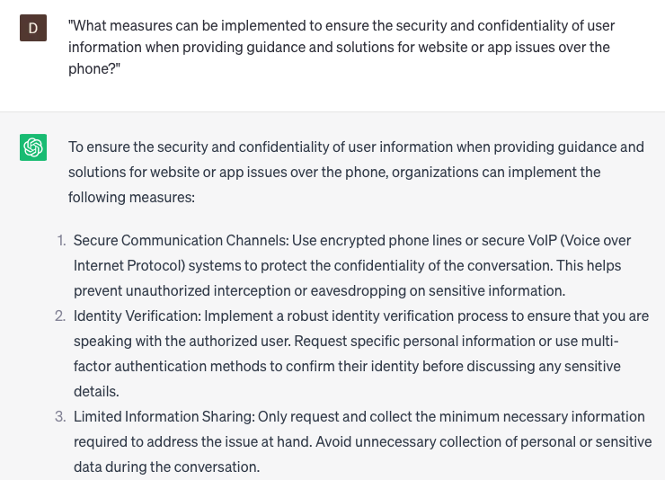

# Offering guidance and solutions for website or app issues over the phone

### FILL-IN-THE-BLANK **PROMPTS:**

```jsx
I'm encountering difficulties with **[specific task]** while using **[website/app]**, and I'm uncertain about the necessary measures to address the problem. Could you please offer a comprehensive walkthrough for resolving this issue? It would be helpful if you could include **[specific steps]** and shed light on the potential causes behind it.
```

```jsx
I have a customer who has reported an **[specific issue]** occurring on **[website/app]**, and I'm uncertain about the appropriate resolution. Could you please provide insights into potential causes for this issue and offer troubleshooting steps that I can take to address it?
```

```jsx
We received a customer complaint regarding our **[website/app]** not functioning correctly on their **[device/browser]**, and I'm uncertain about the appropriate solution. Could you provide some insights into the potential reasons behind this problem, as well as suggest specific steps I can take to assist the customer in resolving the issue from their end?
```

### QUESTIONS-BASED P**ROMPTS:**

1. "How can offering guidance and solutions over the phone effectively address website or app issues and enhance customer satisfaction?"
2. "What strategies can be employed to effectively diagnose and troubleshoot website or app issues remotely over the phone?"
3. "How can phone support agents ensure clear and concise communication while guiding users through complex technical procedures?"
4. "What role does active listening play in resolving website or app issues over the phone, and how can it be effectively employed?"
5. "What are the best practices for providing step-by-step instructions over the phone to help users resolve website or app issues independently?"
6. "How can phone support agents effectively empathize with frustrated or confused users and provide a reassuring and supportive experience?"
7. "What tools or resources can be utilized during phone support sessions to enhance troubleshooting efficiency and accuracy?"
8. "What strategies can be employed to handle escalated website or app issues over the phone, ensuring timely and satisfactory resolutions?"
9. "How can phone support agents proactively identify potential issues or bugs in websites or apps, enabling swift resolutions and customer satisfaction?"
10. "What measures can be implemented to ensure the security and confidentiality of user information when providing guidance and solutions for website or app issues over the phone?"

### EXAMPLES:

