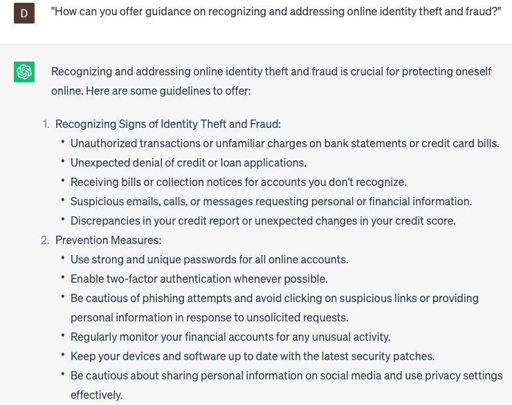

# Offering guidance for online security issues

### FILL-IN-THE-BLANK **PROMPTS:**

```jsx
I'm **[name]**, a customer support agent at **[company]**. We have a customer who has expressed concern regarding **[specific online security issue]**. Could you provide us with detailed **[tips/steps/preventive measures]** that we can share with the customer to address their concerns?
```

```jsx
I require your assistance in aiding our customer, **[name]**, to **[protect their accounts/identify phishing scams/secure their Wi-Fi network]**. Could you please provide me with **[specific tips/instructions/guidelines]** that they can adhere to in order to ensure online safety?
```

```jsx
Hello ChatGPT, one of our customers named **[name]** is seeking guidance on how to enhance their online security, such as **[securing online transactions/recognizing fake websites/protecting personal information online]**. Could you offer any tips, recommended tools, or guidelines that can help them stay safe in their online activities?
```

### QUESTIONS-BASED P**ROMPTS:**

1. "What are the key steps individuals should take to protect their online security and privacy?"
2. "How can you provide guidance and educate users on recognizing and avoiding common online security threats?"
3. "In what ways can you empower users with best practices for creating strong and secure passwords?"
4. "What role does multi-factor authentication play in enhancing online security, and how can you guide users in implementing it?"
5. "How can you educate users on identifying and avoiding phishing attempts and other social engineering techniques?"
6. "What measures can be taken to guide users on securing their devices and keeping their software up to date?"
7. "How can you provide guidance on safely using public Wi-Fi networks and avoiding potential risks?"
8. "What are the best practices for educating users about the importance of regular data backups and safe data storage?"
9. "How can you offer guidance on recognizing and addressing online identity theft and fraud?"
10. "What innovative approaches or technologies can be utilized to deliver personalized and engaging guidance for online security issues?"

### EXAMPLES:

