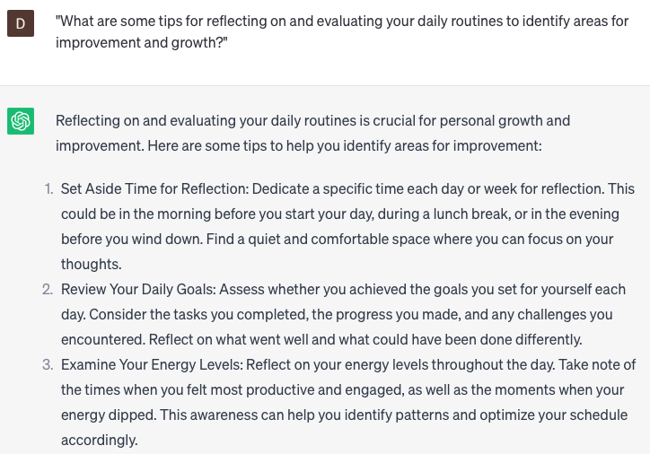

# Optimize daily routines

### FILL-IN-THE-BLANK **PROMPTS:**

```jsx
As a **[job title]**, I face challenges in maintaining organization and productivity throughout the day. Can you share tips and strategies to help me optimize my daily routine and enhance my workflow?
```

```jsx
Can you suggest strategies for **[time blocking/prioritizing tasks]** that can help me better manage my workload and achieve my goals? Please consider insights from experts in **[industry/profession]**.
```

```jsx
As a **[freelancer/entrepreneur]**, I frequently encounter difficulties in achieving a work-life balance and staying focused on my goals. Could you recommend strategies and tools that can assist me in optimizing my daily routine and increasing my productivity?
```

### QUESTIONS-BASED P**ROMPTS:**

1. "How can you establish a morning routine that sets a positive tone for the rest of the day?"
2. "What are some effective techniques for prioritizing tasks and creating a focused to-do list to maximize productivity?"
3. "How can you incorporate regular exercise or physical activity into your daily routine for improved overall well-being?"
4. "What are some strategies for managing time effectively and avoiding common time-wasting activities or distractions?"
5. "How can you optimize your workspace or environment to enhance focus and productivity during your daily routine?"
6. "What are some proven methods for managing stress and incorporating relaxation techniques into your daily routine?"
7. "How can you harness the power of technology and productivity tools to streamline and automate routine tasks?"
8. "What strategies can you employ to minimize decision fatigue and increase efficiency in your daily routines?"
9. "How can you create a healthy work-life balance by establishing boundaries and allocating time for personal activities and self-care?"
10. "What are some tips for reflecting on and evaluating your daily routines to identify areas for improvement and growth?"

### EXAMPLES:

