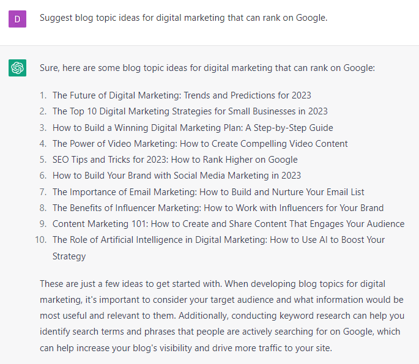

# Optimizing Your Site for SEO

### FILL-IN-THE-BLANK PROMPTS**:**

```jsx
Generate a list of 10 keyword ideas on **[topic]**.

Optional: Only suggest keywords that have high volume and low to medium competition.

Optional: Cluster this list of keywords according to funnel stages whether they are top of the funnel, middle of the funnel or bottom of the funnel keywords (based on previous search).
```

```jsx
Provide a list of top 10 ranking blogs on the keyword [**keyword]**. Mention URL.
```

```jsx
Suggest blog topic ideas for **[topic]** that can rank on Google.
```

```jsx
Write a detailed blog outline on **[topic]** with H2, H3, subheading, and bullet points.
```

```jsx
Provide a list of relevant topics related to **[topic].**
```

```jsx
Who would be the top 3 audiences most interested audiences on **[topic]** to target on Google?
```

```jsx
Provide 10 long tail keywords related to **[topic]**. Match each keyword with any of the 4 types of search intent.
```

```jsx
Help me generate ‘how-to schema markup’ for the following steps on **[topic]**. Pin down your target audience, Choose a Topic, Research Keywords
```

```jsx
Help me write a structured data markup for **[URL].**
```

```jsx
Help me perform sentiment analysis for the following content **[content].**
```

```jsx
Write an HTML code for FAQ Page Schema Markup for the following question and answer. [**question] [answer].**
```

```jsx
Write user-friendly URLs for this keyword on the domain **<domain>** for the following keywords - [**keywords].**
```

```jsx
List the target audience with personal details for the keyword **[keyword].**
```

### EXAMPLES:



