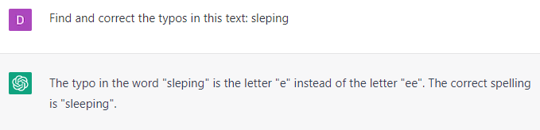

# Proofreading Your Copy

### FILL-IN-THE-BLANK **PROMPTS:**

```jsx
Find and correct the typos in this text: **[copy and paste text].**
```

```jsx
Tell me if there are typos or grammatical errors in this text: **[copy and paste text].**
```

```jsx
Proofread this copy: **[copy and paste text].**
```

```jsx
Fact-check the data in this text: **[copy and paste text].**
```

```jsx
Suggest reliable sources to back up the claims in this text: **[copy and paste text].**
```

### EXAMPLES:

