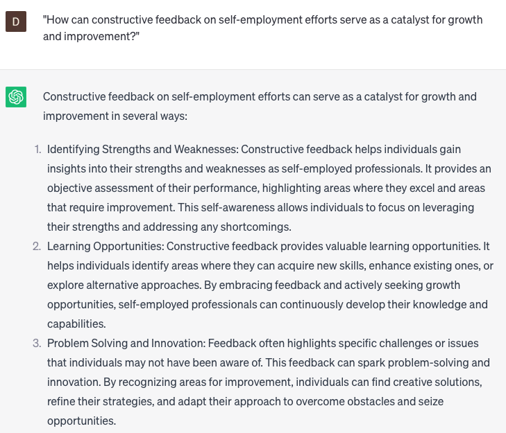

# Provide feedback on self-employment

### FILL-IN-THE-BLANK **PROMPTS:**

```jsx
What are a few methods through which a self-employed **[industry]** company operating within **[work area]** can enhance its productivity and efficiency?
```

```jsx
Based on your expertise, what are some strengths and areas of improvement that you observe in my **[business model/branding]**? Please provide constructive feedback that can help me refine and enhance my self-employment efforts.
```

```jsx
Could you suggest strategies that **[work area]** can employ to allure and retain clients, while delivering top-notch **[product/service]** within the **[specific market/industry]**?
```

### QUESTIONS-BASED P**ROMPTS:**

1. "How can constructive feedback on self-employment efforts serve as a catalyst for growth and improvement?"
2. "In what ways does receiving feedback on self-employment endeavors contribute to gaining valuable insights and fresh perspectives?"
3. "Why is it important to seek feedback on business strategies and decision-making processes to optimize outcomes and results?"
4. "How does feedback on client interactions and customer satisfaction impact the overall success of self-employed professionals?"
5. "Why is it valuable to receive feedback on marketing and branding efforts to effectively position oneself in the market?"
6. "What role does feedback on time management and productivity play in maintaining a healthy work-life balance as a self-employed individual?"
7. "How can feedback on financial management practices help self-employed professionals ensure financial stability and growth?"
8. "Why is it essential to solicit feedback on networking and relationship-building skills to expand professional connections and opportunities?"
9. "In what ways can feedback on personal development and skill enhancement contribute to continuous professional growth and success?"
10. "How does feedback on self-employment goals and milestones aid in tracking progress and adjusting strategies for long-term achievement?"

### EXAMPLES:

