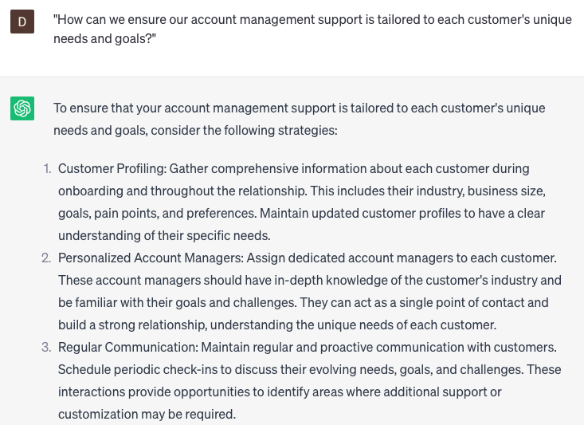

# Providing account management support

### FILL-IN-THE-BLANK **PROMPTS:**

```jsx
Please provide the customer with a comprehensive breakdown of their account **[activity/usage]** throughout the previous **[month/quarter/year]**, including detailed information for their reference.
```

```jsx
Could you please outline the **[detailed/step-by-step]** procedure for updating a customer's account **[information/details]**, such as their **[billing address/contact information/payment method]**?
```

```jsx
What might be the underlying cause of the **[specific/error/issue]** message that the customer is encountering when attempting to perform a **[particular/specific]** action on their account? Additionally, could you provide me with **[detailed/troubleshooting/steps]** to address and resolve the issue?
```

### QUESTIONS-BASED P**ROMPTS:**

1. "How can we ensure our account management support is tailored to each customer's unique needs and goals?"
2. "What strategies can we employ to proactively identify opportunities for account growth and expansion?"
3. "How can we effectively communicate account updates, changes, or important information to our customers?"
4. "Are there any specific tools or software solutions that can enhance our ability to provide comprehensive account management support?"
5. "What measures should we take to address and resolve customer concerns or issues related to their accounts?"
6. "How can we regularly review and analyze account performance to identify areas for improvement and provide actionable insights to our customers?"
7. "What steps can we take to foster strong relationships with our account holders and build trust and loyalty?"
8. "Are there any best practices for developing and implementing account management plans or strategies?"
9. "How can we effectively collaborate with internal teams and departments to ensure seamless account management support?"
10. "What measures should we take to gather feedback from our account holders and continuously improve our account management support processes?"

### EXAMPLES:

