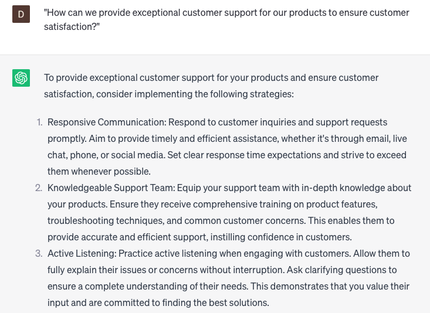

# Providing customer support for products

### FILL-IN-THE-BLANK **PROMPTS:**

```jsx
I am encountering difficulties with my **[product name]**, specifically regarding **[specific issue]**. Could you assist me in troubleshooting this problem?
```

```jsx
I have a keen interest in utilizing **[product feature]** to fulfill a **[specific need]**. Could you recommend the most optimal approach to achieve this using **[product name]**?
```

```jsx
I would like to initiate the **[return/exchange]** of the **[product name]** I purchased on **[purchase date]** due to **[reason for return/exchange]**. Can you assist me in facilitating this process?
```

### QUESTIONS-BASED P**ROMPTS:**

1. "How can we provide exceptional customer support for our products to ensure customer satisfaction?"
2. "What strategies can we employ to effectively troubleshoot and resolve product-related issues reported by customers?"
3. "Are there any specific tools or resources we should utilize to enhance our product support capabilities?"
4. "How can we ensure clear and concise communication when providing product support, especially for complex technical issues?"
5. "What measures should we take to proactively educate customers about the features, functionalities, and best practices of our products?"
6. "Are there any self-service options or knowledge bases we can provide to empower customers in finding answers to common product-related questions?"
7. "How can we gather customer feedback and insights to identify areas for product improvement and inform future updates or releases?"
8. "What steps can we take to continuously train and educate our customer support team to stay knowledgeable about our products and provide effective assistance?"
9. "How can we efficiently document and track product support interactions to maintain a comprehensive support history for each customer?"
10. "What strategies should we implement to offer seamless integration support, if applicable, for customers using our products with other systems or platforms?"

### EXAMPLES:

