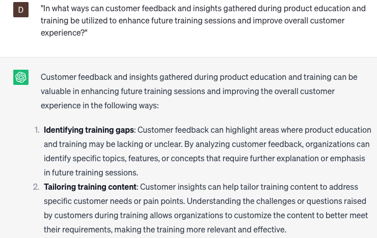

# Providing product education and training over the phone

### FILL-IN-THE-BLANK **PROMPTS:**

```jsx
What is an effective way to structure my **[first/initial]** phone conversation with a **[new/potential/prospective]** customer during the onboarding process?
```

```jsx
What key elements should I incorporate into my **[follow-up/second/next]** phone conversation with a **[new/potential/prospective]** customer subsequent to the initial onboarding call?
```

```jsx
What are effective methods for leveraging **[visual aids/product demos/customer success stories]** in onboarding phone discussions to optimize the customer's comprehension and involvement with our product?
```

### QUESTIONS-BASED P**ROMPTS:**

1. "How can providing product education and training over the phone enhance customer knowledge and satisfaction?"
2. "What key elements should be included in providing comprehensive product education and training over the phone?"
3. "How can active listening and effective questioning techniques be employed to assess customer knowledge gaps and tailor training accordingly?"
4. "What strategies can be used to deliver clear and concise explanations of product features, functionalities, and usage instructions over the phone?"
5. "How can product demonstrations and walkthroughs be conducted effectively over the phone to enhance customer understanding?"
6. "What role does patience and empathy play in guiding customers through product education and training over the phone?"
7. "What are the benefits of providing follow-up materials, such as user manuals or video tutorials, to customers after product education and training over the phone?"
8. "How can ongoing support and access to a dedicated product education team be provided to customers even after the initial phone training?"
9. "What techniques can be used to assess the effectiveness of product education and training over the phone, such as customer surveys or knowledge assessments?"
10. "In what ways can customer feedback and insights gathered during product education and training be utilized to enhance future training sessions and improve overall customer experience?"

### EXAMPLES:

