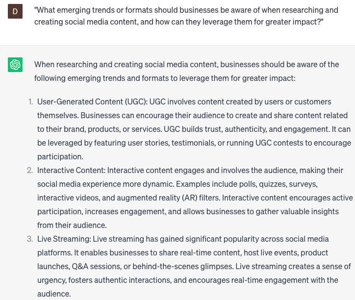

# Researching and creating social content

### FILL-IN-THE-BLANK **PROMPTS:**

```jsx
Could you propose **[number]** distinctive social media post ideas centered around **[topic/keyword]**, aiming to boost engagement with our audience?
```

```jsx
What are some thought-provoking questions, designed to spark conversation and enhance engagement, that we can pose to our followers on **[social media platform]**?
```

```jsx
Could you suggest visually captivating methods, with an emphasis on **[adjective]**, to present **[data/statistics]** related to **[topic/keyword]** on social media?
```

### QUESTIONS-BASED P**ROMPTS:**

1. "What strategies can businesses employ to conduct thorough research and gather insights that inform the creation of engaging social media content?"
2. "How can businesses leverage customer surveys, polls, or focus groups to better understand their target audience and tailor social media content accordingly?"
3. "What are some effective methods for conducting competitor analysis to identify content gaps and opportunities within a specific industry or niche?"
4. "How can businesses use keyword research and SEO techniques to optimize their social media content for increased visibility and reach?"
5. "What role does storytelling play in creating compelling social media content that resonates with the target audience?"
6. "How can businesses incorporate visual elements, such as images, videos, or infographics, into their social media content to enhance engagement and shareability?"
7. "What are some creative ways businesses can repurpose existing content or leverage user-generated content to supplement their social media content strategy?"
8. "How can businesses ensure that their social media content is aligned with their brand values, voice, and overall marketing objectives?"
9. "What are some effective techniques for testing and iterating social media content to optimize its performance and audience response?"
10. "What emerging trends or formats should businesses be aware of when researching and creating social media content, and how can they leverage them for greater impact?"

### EXAMPLES:

