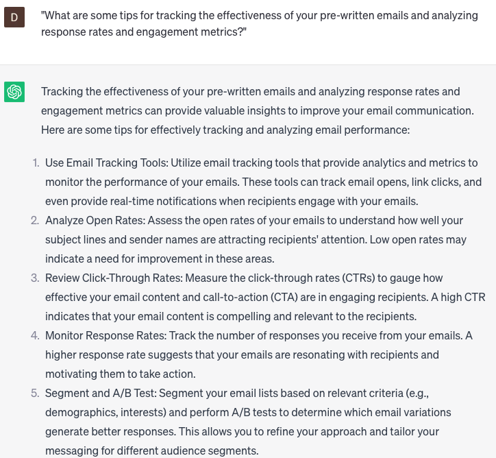

# Send pre-written emails

### FILL-IN-THE-BLANK **PROMPTS:**

```jsx
Could you assist me in composing a follow-up email to send to **[contact name]** at **[work area]** subsequent to our meeting on **[meeting date]**? I would like to express gratitude for their time, recap our conversation, and propose a follow-up meeting.
```

```jsx
Our team frequently sends out standard emails for **[purpose/task]**. Can you help us streamline the process by suggesting **[email templates/automated email tools]** that allow us to easily send pre-written emails personalized with **[customer/client]** information?
```

```jsx
Could you assist me in composing an email to send to **[colleague name]** at **[company name]** regarding an internal project update? I would like to share the current status of the project, highlight any noteworthy achievements or obstacles, and outline the next steps moving forward.
```

### QUESTIONS-BASED P**ROMPTS:**

1. "What are some effective subject lines that grab attention and increase open rates in pre-written emails?"
2. "How can you personalize pre-written emails to make them feel more tailored and relevant to the recipient?"
3. "What strategies can you employ to ensure that your pre-written emails are concise and to the point?"
4. "How do you maintain a professional tone in pre-written emails while still injecting personality and warmth?"
5. "What are some key elements to include in the opening paragraph of a pre-written email to engage the recipient right away?"
6. "What are some proven techniques for crafting compelling calls-to-action in pre-written emails?"
7. "How can you optimize the layout and formatting of pre-written emails to enhance readability and visual appeal?"
8. "What are the best practices for proofreading and editing pre-written emails to catch errors and improve overall quality?"
9. "How can you leverage storytelling techniques in pre-written emails to captivate readers and build a connection?"
10. "What are some tips for tracking the effectiveness of your pre-written emails and analyzing response rates and engagement metrics?"

### EXAMPLES:

