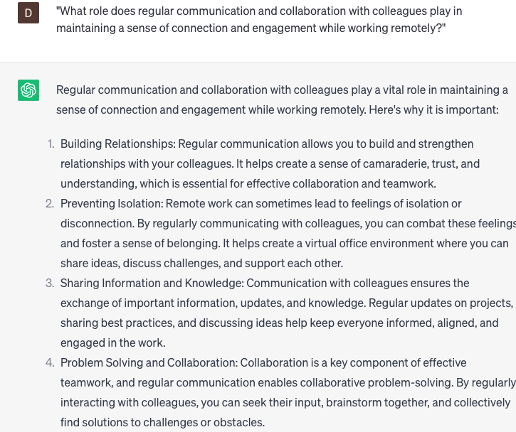

# Suggest healthy work from home habits

### FILL-IN-THE-BLANK **PROMPTS:**

```jsx
What are some effective methods for establishing a healthy work-from-home routine among employees at **[company name]** to enhance their **[specific need]** and uphold their **[specific need]**?
```

```jsx
What are some recommendations to establish a comfortable and ergonomically sound workspace for **[job title]** when working from home?
```

```jsx
What are a few strategies to foster motivation and engagement among members of **[team name]** in a remote work setup?
```

### QUESTIONS-BASED P**ROMPTS:**

1. "What are some effective strategies for incorporating regular breaks and movement into your work-from-home routine?"
2. "How can establishing a dedicated workspace and maintaining a consistent work schedule positively impact productivity and well-being in a remote work environment?"
3. "What are some practical tips for setting boundaries between work and personal life when working from home?"
4. "In what ways can individuals prioritize self-care and mental well-being while working remotely?"
5. "How does effective time management, prioritization, and goal setting contribute to a productive and balanced work-from-home experience?"
6. "What role does regular communication and collaboration with colleagues play in maintaining a sense of connection and engagement while working remotely?"
7. "What are some healthy eating habits and nutrition tips that can support energy levels and overall well-being during remote work?"
8. "How can individuals minimize distractions and create a focused work environment at home?"
9. "What strategies can individuals implement to manage stress and maintain a positive mindset while working from home?"
10. "What resources or tools are available to support healthy work-from-home habits, such as mindfulness apps, ergonomic equipment, or wellness programs?"

### EXAMPLES:

