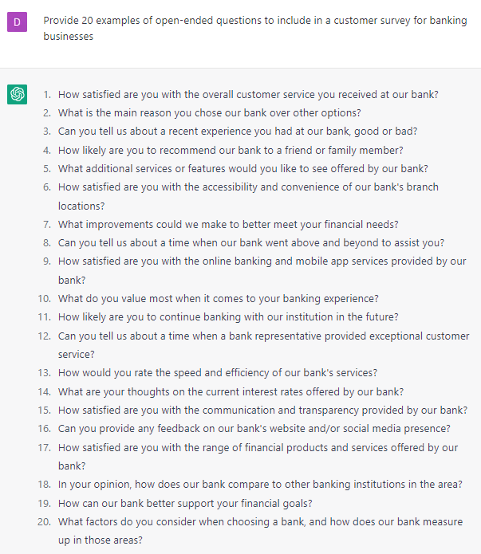

# Surveying Your Customers

### FILL-IN-THE-BLANK **PROMPTS:**

```jsx
Give me 10 questions I can use to survey my customers and gauge their satisfaction level.
```

```jsx
Provide 20 examples of open-ended questions to include in a customer survey for **[company type].**
```

```jsx
List the most important metrics to track in a customer survey to increase customer satisfaction and retention.
```

```jsx
Brainstorm 20 questions I can ask my customers to see what other products do they need.
```

### EXAMPLES**:**

