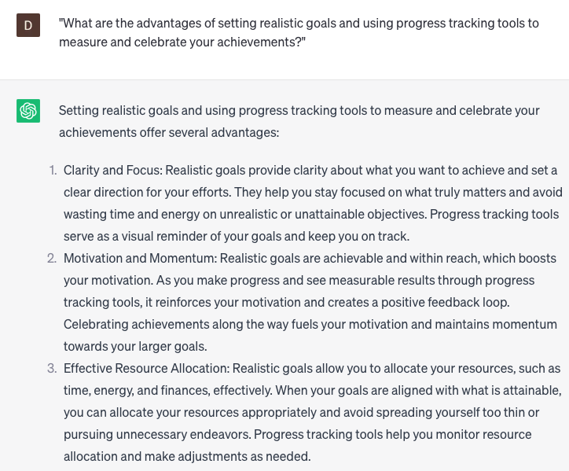

# Track calories and activity

### FILL-IN-THE-BLANK **PROMPTS:**

```jsx
Could you develop a personalized meal plan for me, with a daily intake of **[x]** grams of protein, **[y]** grams of carbohydrates, and **[z]** grams of fat?
```

```jsx
What would be the recommended daily calorie intake for me to achieve a weight loss of **[x]** pounds per week?
```

```jsx
Could you recommend some nutritious snack choices that are **[high/low]** in protein and **[high/low]** in calories?
```

### QUESTIONS-BASED P**ROMPTS:**

1. "How can tracking your calorie intake and activity level provide insights into your overall health and fitness journey?"
2. "What role does keeping a food diary or using a calorie tracking app play in maintaining a balanced and mindful approach to nutrition?"
3. "In what ways can monitoring your daily steps or physical activity help you stay motivated and reach your fitness goals?"
4. "What benefits can be gained from understanding the energy balance equation and tracking calories consumed versus calories burned?"
5. "How does tracking macronutrients (protein, carbohydrates, and fats) contribute to optimizing your nutrition and achieving desired body composition?"
6. "What strategies can individuals employ to stay consistent with tracking calories and activity, even during busy or challenging times?"
7. "How can technology, such as fitness trackers or smart scales, assist in accurately tracking calories and monitoring progress?"
8. "What impact can meal planning and prepping have on simplifying calorie tracking and ensuring nutritional balance?"
9. "What are the advantages of setting realistic goals and using progress tracking tools to measure and celebrate your achievements?"
10. "How does the awareness gained from tracking calories and activity empower you to make informed choices and take control of your health?"

### EXAMPLES:

