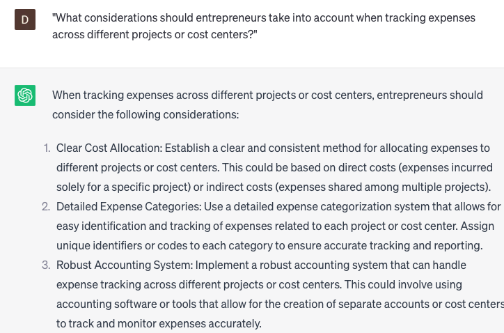

# Track expenses

### FILL-IN-THE-BLANK **PROMPTS:**

```jsx
Could you provide a summary of my expenses incurred during **[month/year]**?
```

```jsx
When it comes to tracking expenses, what tools or methods can individuals use to **[keep tabs on their spending/monitor financial transactions]**? Consider options for **[expense tracking apps/spreadsheet templates/online banking tools]**.
```

```jsx
What is the remaining budget allocation for **[category]** in **[month/year]**?
```

### QUESTIONS-BASED P**ROMPTS:**

1. "What methods or tools do you recommend for entrepreneurs to effectively track and monitor their business expenses?"
2. "Can you provide insights on how tracking expenses can help identify cost-saving opportunities and improve financial decision-making?"
3. "How can categorizing and organizing expenses contribute to better expense tracking and analysis?"
4. "What strategies can entrepreneurs employ to streamline expense tracking processes and ensure accuracy?"
5. "Can you explain the benefits of utilizing expense tracking software or apps to simplify the process and generate useful reports?"
6. "How can regular expense reconciliation and auditing help identify discrepancies or potential fraudulent activities?"
7. "What role does expense tracking play in creating more accurate financial statements and forecasting future expenses?"
8. "Can you provide examples of key financial metrics or ratios that entrepreneurs should track to assess expense efficiency?"
9. "How can entrepreneurs effectively track and manage expenses related to business travel or entertainment?"
10. "What considerations should entrepreneurs take into account when tracking expenses across different projects or cost centers?"

### EXAMPLES:

