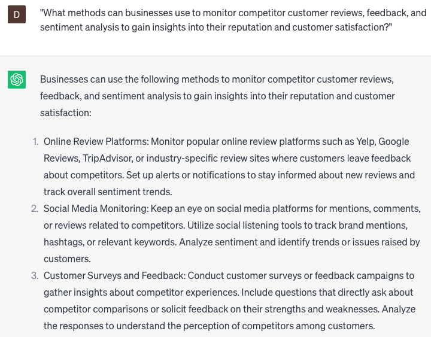

# Tracking competitor activities

### FILL-IN-THE-BLANK **PROMPTS:**

```jsx
What methods can be employed to monitor and analyze changes in **[competitor]**'s product offerings and effectively compare them to our own, encompassing aspects such as features and pricing?
```

```jsx
What steps should be taken to perform an extensive analysis of **[competitor]**'s marketing strategy, encompassing aspects like branding, messaging, and target audience, in order to identify their strengths and weaknesses?
```

```jsx
What methods can be utilized to analyze the sales and revenue trends of **[competitor]** over the previous year, detect patterns, and identify potential growth opportunities?
```

### QUESTIONS-BASED P**ROMPTS:**

1. "What are some effective strategies for tracking and monitoring competitor activities to stay informed about their marketing tactics and business initiatives?"
2. "How can businesses leverage competitive intelligence to gain insights into their competitors' strengths, weaknesses, and market positioning?"
3. "What tools or resources can businesses utilize to collect and analyze data on competitor activities, such as pricing changes, product launches, or advertising campaigns?"
4. "How can businesses effectively track competitor social media presence and engagement to understand their audience reach and online strategies?"
5. "What role does benchmarking play in tracking competitor activities, and how can businesses use it to identify areas for improvement and innovation?"
6. "What ethical considerations should businesses keep in mind when tracking competitor activities, such as respecting intellectual property rights and avoiding deceptive practices?"
7. "How can businesses analyze competitor websites and online content to gain insights into their SEO strategies, content marketing approach, and user experience?"
8. "What are some indicators or metrics that businesses can monitor to assess the success or impact of their competitors' marketing campaigns or business initiatives?"
9. "What methods can businesses use to monitor competitor customer reviews, feedback, and sentiment analysis to gain insights into their reputation and customer satisfaction?"
10. "How can businesses leverage the information gathered from tracking competitor activities to refine their own marketing strategies, differentiate themselves, and gain a competitive edge in the market?"

### EXAMPLES:

