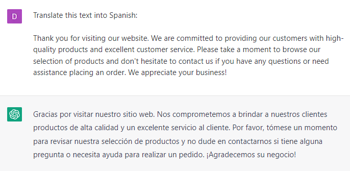

# Translating Website Copy Into Different Languages

### FILL-IN-THE-BLANK **PROMPTS:**

```jsx
Translate this text into **[language]**:
**[Copy and paste text].**
```

```jsx
What are some alternative ways to phrase the following text in **[language]?
[Copy and paste text].**
```

### OPEN-ENDED **PROMPTS:**

1. “Can you translate this text for me?”
2. “I need help with translating this document, can you assist me?”
3. “Can Chat GPT provide me with a translation of this text?”
4. “I don't understand this text, can you translate it for me?”
5. “Can you help me to convert this text into another language?”
6. “Is it possible for Chat GPT to translate this passage into a different language?”
7. “Can you assist me with a translation of this paragraph?”
8. “Can Chat GPT help me to understand this text by translating it for me?”
9. “I need a translation of this document, can you help me out?”
10. “Can you translate this text into [target language]?”

### EXAMPLES:




###