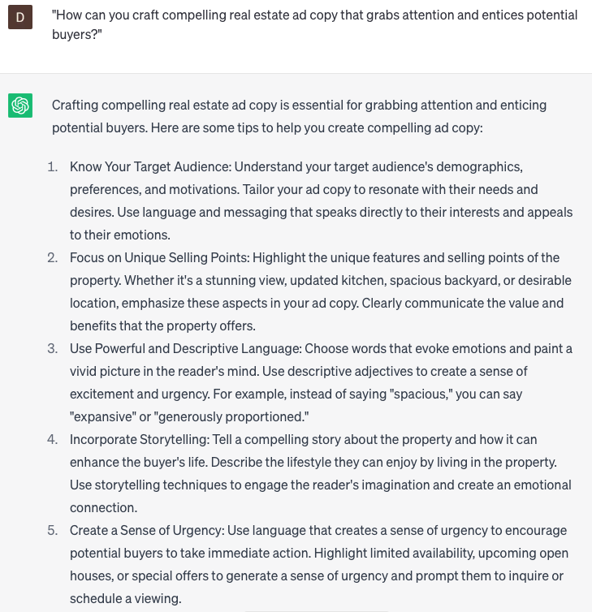

# Write real estate ad copy

### FILL-IN-THE-BLANK **PROMPTS:**

```jsx
Help me generate a property description for a **[property type]** situated in **[city], [state].** Include details such as **[number]** bedrooms, **[number]** bathrooms, and any distinctive **[additional features]** that make this property stand out.
```

```jsx
Craft an impactful real estate ad copy of **[length]** for a captivating **[property type]** nestled in the vibrant heart of **[city], [state]**. Inspired by the 'Art of Seductive Copywriting' by Joseph Sugarman, employ persuasive language that highlights the irresistible **[key features]** of the property, such as **[feature 1], [feature 2]**, and **[feature 3].** Tailor the copy to capture the attention of **[target audience].**
```

```jsx
Please create a captivating real estate ad that showcases the **[value]** and **[potential]** of a **[property type]** situated in the city of **[city], [state]**. Use persuasive language to highlight the numerous benefits of this property, including **[benefit 1], [benefit 2]**, and **[benefit 3]**, while ensuring the ad is tailored to appeal to our specific **[target audience]**.
```

### QUESTIONS-BASED P**ROMPTS:**

1. "How can you craft compelling real estate ad copy that grabs attention and entices potential buyers?"
2. "What are some persuasive language techniques you can use in real estate ad copy to evoke emotion and create a sense of desire?"
3. "How important is it to highlight the unique selling points and features of a property in your real estate ad copy?"
4. "What are some effective strategies for conveying a sense of urgency or exclusivity in your real estate ad copy?"
5. "How can you tailor your real estate ad copy to appeal to specific buyer demographics or target markets?"
6. "What role does storytelling play in writing engaging real estate ad copy that resonates with potential buyers?"
7. "How can you effectively use numbers, statistics, and data in your real estate ad copy to communicate value and credibility?"
8. "What are some successful approaches to creating compelling headlines and hooks in your real estate ad copy?"
9. "How can you address potential buyer objections or concerns in your real estate ad copy to build trust and overcome hesitations?"
10. "What are some proven techniques for writing strong calls-to-action in your real estate ad copy that encourage immediate action from potential buyers?"

### EXAMPLES:

