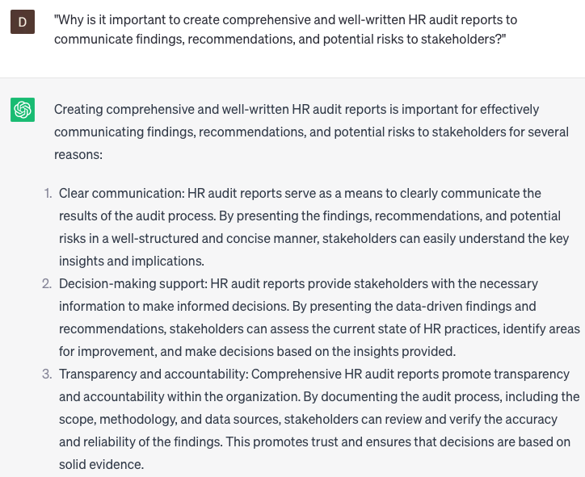

# Writing HR audit reports

### FILL-IN-THE-BLANK **PROMPTS:**

```jsx
Could you furnish me with a comprehensive checklist, consisting of **[number]** points, for conducting an HR audit for **[company name]**? The checklist should encompass crucial areas like **[area 1], [area 2]**, and **[area 3]**. Additionally, could you offer any further recommendations for including considerations related to **[area 4]** and **[area 5]** in the audit?
```

```jsx
What is the most effective approach to evaluating the **[compliance type]** compliance level of **[company name]** concerning **[specific law/regulation]**, **[another specific law/regulation]**, and **[number]** other pertinent laws and regulations? I would greatly appreciate a comprehensive analysis of **[compliance area 1]**, **[compliance area 2]**, and **[compliance area 3]**, accompanied by recommendations for enhancing compliance.
```

```jsx
What are the primary risks and challenges pertaining to **[HR area]** that **[company name]** may encounter, and how can they be effectively mitigated or resolved? In your response, please provide examples of **[specific risk 1], [specific risk 2]**, and **[specific risk 3]**, along with specific measures that can be implemented to address these risks.
```

### QUESTIONS-BASED P**ROMPTS:**

1. "Why is it important to create comprehensive and well-written HR audit reports to communicate findings, recommendations, and potential risks to stakeholders?"
2. "What key components should be included in an HR audit report to provide a clear and thorough assessment of HR practices, policies, and compliance?"
3. "How can HR audit reports effectively summarize and present complex data and analysis, making it accessible and understandable to non-HR professionals?"
4. "In what ways can HR audit reports help identify areas of improvement and opportunities for enhancing HR processes and practices within the organization?"
5. "What strategies can be employed in writing HR audit reports to ensure objectivity, accuracy, and consistency in reporting findings and recommendations?"
6. "How can HR audit reports address legal and regulatory compliance, highlighting any gaps or potential risks that need to be addressed?"
7. "What role can data visualization and graphical representations play in HR audit reports to enhance the clarity and impact of the information presented?"
8. "How can HR audit reports incorporate benchmarking and best practices comparisons to provide context and insights into industry standards?"
9. "What measures should be taken to ensure confidentiality and secure handling of sensitive information when writing HR audit reports?"
10. "How can HR audit reports effectively communicate the potential impact and value of recommended changes, influencing decision-making and driving positive HR outcomes?"

### EXAMPLES:

