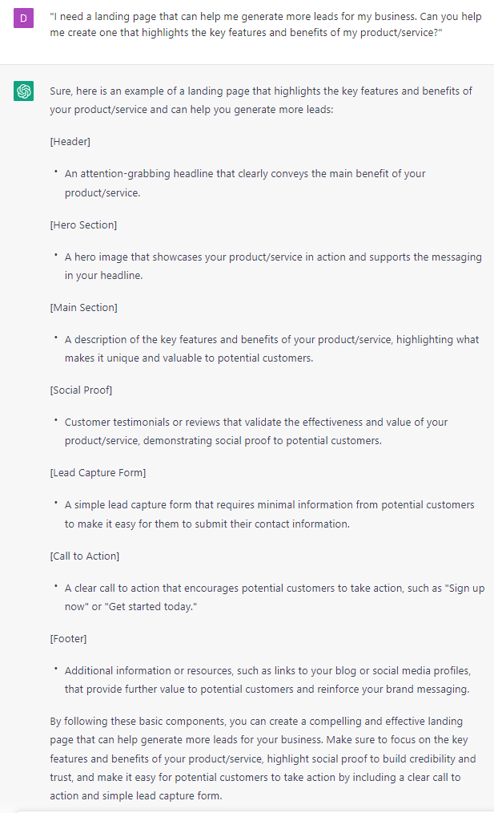

# Writing a Landing Page (For Opt-Ins or Webinar Registrations)

### FILL-IN-THE-BLANK **PROMPTS:**

```jsx
Write a landing page that offers **[lead magnet]** to **[audience]**. This free **[ebook/webinar/video series]** will help them:
-**[Benefit 1]**
-**[Benefit 2]**
-**[Benefit 3]**
Mention that it is completely free and that I can help them because **[include credentials].**
```

```jsx
Can you help me create a landing page for my [product/service] that converts visitors into customers? Here are some details about my [product/service]: [insert details such as benefits, unique selling points, target audience, etc.].
```

### OPEN-ENDED PROMPTS**:**

1. "I need a landing page that can help me generate more leads for my business. Can you help me create one that highlights the key features and benefits of my product/service?"
2. "I'm launching a new product and I need a landing page that can capture the attention of potential customers. Can you help me create one that's visually appealing and easy to navigate?"
3. "I want to promote my upcoming event and I need a landing page that can help me sell tickets. Can you help me create a page that includes all the necessary information and encourages visitors to register?"
4. "I need a landing page that can showcase my portfolio and services as a freelancer. Can you help me create a page that highlights my skills and encourages potential clients to get in touch?"
5. "I want to create a landing page for my e-book and I need it to be persuasive enough to convert visitors into customers. Can you help me create one that includes a clear call-to-action and highlights the key benefits of my book?"
6. "I need a landing page that can convince visitors to sign up for my free trial. Can you help me create one that highlights the unique features of my product and persuades visitors to take action?"
7. "I'm looking to generate more sales for my e-commerce store and I need a landing page that can help me convert visitors into customers. Can you help me create one that's visually appealing and includes persuasive product descriptions?"

### EXAMPLES:

