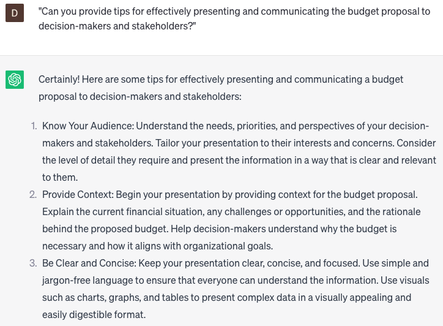

# Writing budget proposals

### FILL-IN-THE-BLANK **PROMPTS:**

```jsx
Prepare a budget proposal for **[business name]** encompassing a **[duration]** period. The proposal should include the following categories: **[category 1], [category 2]**, and **[category 3]**. Each category should have a target budget of **[budget amount]**. Please provide a comprehensive breakdown of expenses and a summary of projected income for the specified period.
```

```jsx
Employing the principles of "Zero-Based Budgeting" discussed in the book "Profit First" by Mike Michalowicz, develop a budget proposal for **[business name]** for the **[duration]** period. The proposal should involve a thorough review of expenses in **[category 1], [category 2],** and **[category 3]**, requiring justification for each expense and reassessment of their necessity. The aim is to optimize resource allocation while aligning with the target budget of **[budget amount]**, ultimately fostering financial stability and profitability.
```

```jsx
Prepare a budget proposal for **[event name]** that encompasses the entire duration of the event. The proposal should comprise the following categories: **[category 1], [category 2],** and **[category 3]**. Each category should have a target budget of **[budget amount]**. Please provide an itemized breakdown of expenses and a summary of anticipated income for the specified period. Additionally, include a dedicated section on sponsorships and partnerships for the event.
```

### QUESTIONS-BASED P**ROMPTS:**

1. "How can I effectively outline the budgetary needs and objectives in a compelling budget proposal?"
2. "What are the key components that should be included in a budget proposal to ensure clarity and transparency?"
3. "Can you provide guidance on conducting cost analysis and estimating expenses for different budget categories?"
4. "How can I demonstrate the potential return on investment and financial benefits of the proposed budget in the proposal?"
5. "What strategies can be employed to address potential challenges and risks in the budget proposal?"
6. "Can you explain the process of justifying and prioritizing budget requests based on organizational goals and objectives?"
7. "How can I incorporate supporting data and evidence, such as financial projections or industry benchmarks, into the budget proposal?"
8. "What role does stakeholder engagement and collaboration play in crafting a successful budget proposal?"
9. "Are there any specific formatting guidelines or templates to follow when writing a budget proposal?"
10. "Can you provide tips for effectively presenting and communicating the budget proposal to decision-makers and stakeholders?"

### EXAMPLES:

