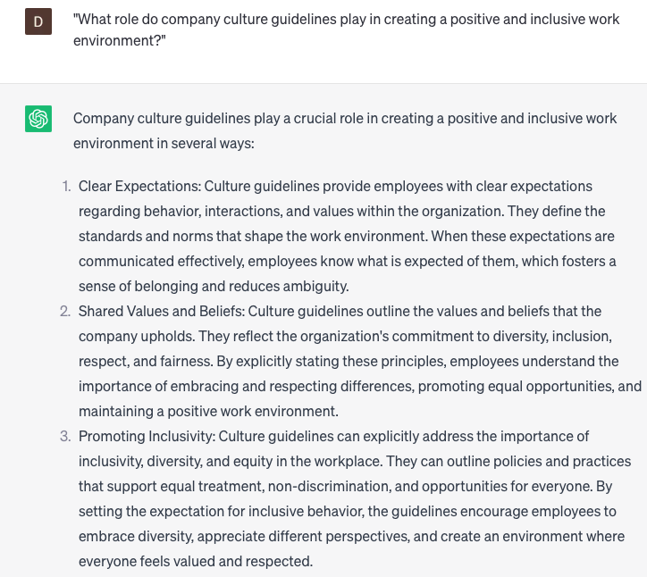

# Writing company culture guidelines

### FILL-IN-THE-BLANK **PROMPTS:**

```jsx
Could you provide specific **[tactics, strategies, or tools]** that can be utilized by **[specific audience, e.g. managers, employees, HR]** to effectively **[specific action or behavior, e.g. communicate, model, reinforce]** our company culture guidelines, particularly pertaining to **[example of a value or behavior]** and **[example of another value or behavior]**?
```

```jsx
Could you suggest **[specific types of training, initiatives, or policies]** that we can implement to foster **[specific aspect of diversity, equity, and inclusion, e.g. allyship, intersectionality, representation]** within our company culture guidelines? For instance, we are interested in examples like **[example of a policy or initiative]** and how to measure related success metrics.
```

```jsx
In order to align our culture guidelines with our company's **[specific mission or values, e.g. sustainability, social responsibility, customer focus]**, we seek guidance on ensuring they are **[specific adjective or characteristic, e.g. authentic, actionable, measurable]**. This may include incorporating elements like **[example of a mission or value]**, implementing **[example of a related behavior or policy]**, and establishing **[example of a related success metric]**.
```

### QUESTIONS-BASED P**ROMPTS:**

1. How can writing company culture guidelines effectively communicate the organization's values and expectations to employees?"
2. "What role do company culture guidelines play in creating a positive and inclusive work environment?"
3. "Why is it important to involve employees in the process of developing company culture guidelines?"
4. "How can company culture guidelines promote consistency and alignment across different teams and departments within an organization?"
5. "What strategies can be employed in writing company culture guidelines to encourage employee engagement and commitment?"
6. "How do company culture guidelines contribute to attracting and retaining top talent in a competitive job market?"
7. "What are some effective ways to ensure that company culture guidelines are not just words on paper but are actively practiced and embraced by employees?"
8. "How can company culture guidelines address the balance between maintaining a positive work environment and encouraging healthy competition?"
9. "What considerations should be taken into account when writing company culture guidelines for a diverse and multicultural workforce?"
10. "In what ways can company culture guidelines adapt and evolve with the changing needs and dynamics of the organization?"

### EXAMPLES:

