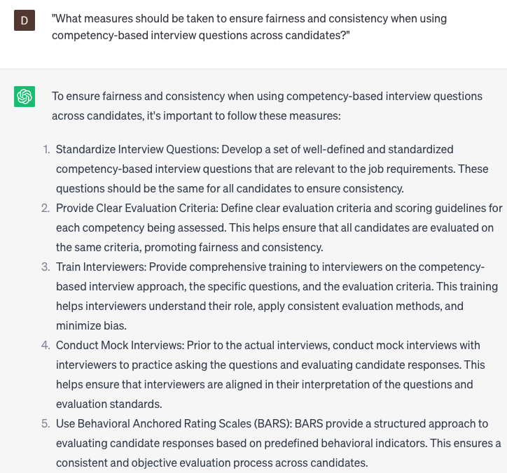

# Writing competency-based interview questions

### FILL-IN-THE-BLANK **PROMPTS:**

```jsx
Please share an experience from your past where you encountered a **[specific challenge or problem]** within a **[specific context or situation]** that demanded the utilization of **[specific skill or competency]**. Describe your approach to the situation and the steps you took to resolve the problem. What was the ultimate outcome, and what valuable insights did you gain from the experience?
```

```jsx
Describe an instance when you undertook a **[specific task or responsibility]** within a **[specific context or environment]** that presented limitations in terms of resources or support. Elaborate on how you navigated the situation and outline the steps you implemented to accomplish the desired outcome.
```

```jsx
What is your approach to addressing **[specific type of challenge or conflict]** within the workplace, and what measures do you undertake to effectively resolve such issues? Could you share an example of a time when you adeptly managed a challenging situation? Please describe the outcome of that experience and highlight the valuable lessons you gained from it.
```

### QUESTIONS-BASED P**ROMPTS:**

1. "Why is it important to use competency-based interview questions in the hiring process?"
2. "What are the key characteristics of effective competency-based interview questions?"
3. "How can competency-based interview questions help assess a candidate's skills, knowledge, and abilities relevant to the job?"
4. "What strategies can be used to align competency-based interview questions with the desired competencies for a specific role?"
5. "Why is it important to structure competency-based interview questions using the STAR (Situation, Task, Action, Result) method?"
6. "How can open-ended competency-based interview questions encourage candidates to provide detailed and specific examples?"
7. "What role does active listening play when asking competency-based interview questions and evaluating candidate responses?"
8. "Why is it valuable to follow-up with probing questions to gain further insights into a candidate's competencies?"
9. "How can competency-based interview questions help differentiate between candidates who possess similar qualifications on paper?"
10. "What measures should be taken to ensure fairness and consistency when using competency-based interview questions across candidates?"

### EXAMPLES:

