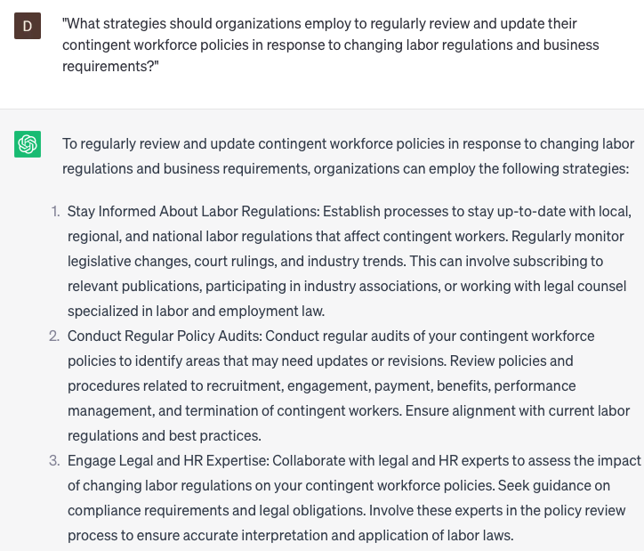

# Writing contingent workforce policies

### FILL-IN-THE-BLANK **PROMPTS:**

```jsx
Could you provide some suggested policies for contingent workers in **[geographic location]** with **[special circumstance]** in the **[specific job function]** domain?
```

```jsx
I would appreciate your assistance in drafting a contingent workforce policy that effectively handles **[specific issue]**, such as **[example]**, while ensuring compliance with relevant **[legal/industry]** regulations and aligning with our **[company]** values.
```

```jsx
What are the recommended strategies and best practices for managing a contingent workforce during **[specific event or circumstance]**, like **[example]**, within the **[industry/field]** sector?
```

### QUESTIONS-BASED P**ROMPTS:**

1. "Why is it essential for organizations to establish robust contingent workforce policies to effectively manage and govern the use of temporary or contract workers?"
2. "What are the key elements that should be included in contingent workforce policies to ensure compliance with labor laws, protect the rights of contingent workers, and mitigate legal risks?"
3. "How can organizations strike a balance between flexibility and control when designing contingent workforce policies to meet their evolving business needs?"
4. "What considerations should organizations take into account when defining the scope of work, payment terms, and termination procedures within their contingent workforce policies?"
5. "What role does effective communication and clear expectations play in contingent workforce policies to ensure alignment between the organization and contingent workers?"
6. "How can organizations address potential challenges and risks associated with contingent workforce management through comprehensive policies and procedures?"
7. "What measures can organizations incorporate in their contingent workforce policies to promote fair treatment, equal opportunities, and inclusion for contingent workers?"
8. "How can organizations leverage technology and digital tools to streamline the implementation and monitoring of contingent workforce policies?"
9. "What strategies should organizations employ to regularly review and update their contingent workforce policies in response to changing labor regulations and business requirements?"
10. "In what ways can organizations foster positive relationships and effective collaboration between their permanent employees and contingent workers through well-defined contingent workforce policies?"

### EXAMPLES:

