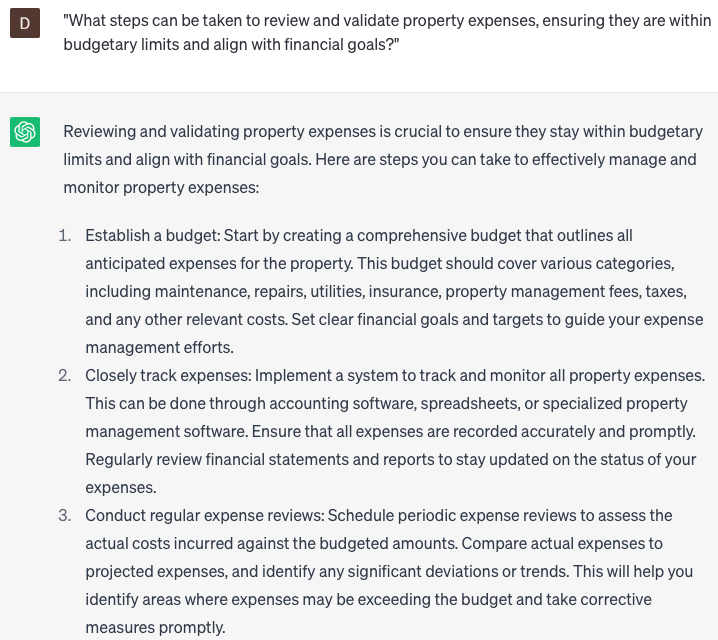

# Writing property expense reports

### FILL-IN-THE-BLANK **PROMPTS:**

```jsx
Help me generate a comprehensive expense report for my **[property type]** located in **[city]**. The property features **[number]** bedrooms, **[number]** bathrooms, and spans **[size]** square feet.
```

```jsx
What potential expenses should I include in the expense report for my **[property type]** in **[location]** with **[number]** units and a total square footage of **[size]**?
```

```jsx
Recommend upgrades or improvements for my **[property type]** in **[location]**. It has **[number]** units and a total area of **[size]**. These should help decrease long-term expenses and increase property value.
```

### QUESTIONS-BASED P**ROMPTS:**

1. "What are the essential categories of expenses that should be included in a property expense report?"
2. "How can you accurately track and document property-related expenses for efficient reporting?"
3. "What information should be included for each expense entry in a property expense report, such as date, description, and amount?"
4. "How can you categorize and classify expenses in a property expense report to provide a clear overview of financial activity?"
5. "What are the best practices for organizing and presenting a property expense report in a professional and understandable format?"
6. "What strategies can be used to analyze and identify trends in property expenses based on historical data and reports?"
7. "How can you ensure the accuracy and completeness of a property expense report by reconciling it with supporting documents and receipts?"
8. "What additional documentation or supporting materials should be attached to a property expense report to provide transparency and clarity?"
9. "What steps can be taken to review and validate property expenses, ensuring they are within budgetary limits and align with financial goals?"
10. "How can you leverage technology and software tools to streamline the process of creating and managing property expense reports?"

### EXAMPLES:

