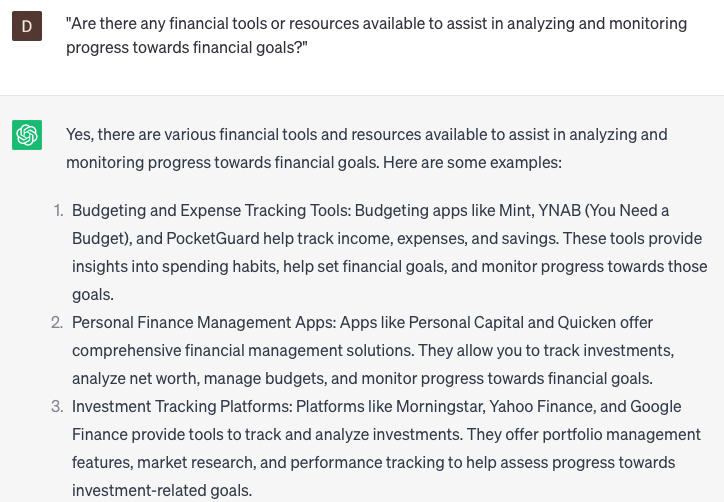

# Analyze financial goals

### FILL-IN-THE-BLANK **PROMPTS:**

```jsx
Which key financial metrics should a **[work area]** company prioritize when establishing financial goals, and what strategies can be employed to optimize these metrics?
```

```jsx
What are the potential advantages and disadvantages associated with investing in **[specific financial product/industry]** given my financial objectives and risk tolerance **[goals]**?
```

```jsx
Could you assist me in formulating a comprehensive financial plan that encompasses both my short-term and long-term financial goals **[goals]**, along with strategies for managing risks?
```

### QUESTIONS-BASED P**ROMPTS:**

1. "What steps can I take to identify and prioritize my financial goals effectively?"
2. "Can you provide guidance on setting specific, measurable, achievable, relevant, and time-bound (SMART) financial goals?"
3. "How can I align my short-term and long-term financial goals to create a cohesive and balanced plan?"
4. "What factors should I consider when assessing the feasibility and potential challenges associated with my financial goals?"
5. "Can you explain the concept of risk tolerance and its influence on determining appropriate financial goals?"
6. "What strategies can be employed to break down larger financial goals into smaller, manageable milestones?"
7. "How can I incorporate flexibility and adaptability into my financial goals to accommodate changing circumstances?"
8. "What role does periodic evaluation and progress tracking play in analyzing and adjusting financial goals?"
9. "Can you provide guidance on prioritizing conflicting financial goals and making trade-offs when necessary?"
10. "Are there any financial tools or resources available to assist in analyzing and monitoring progress towards financial goals?"

### EXAMPLES:

