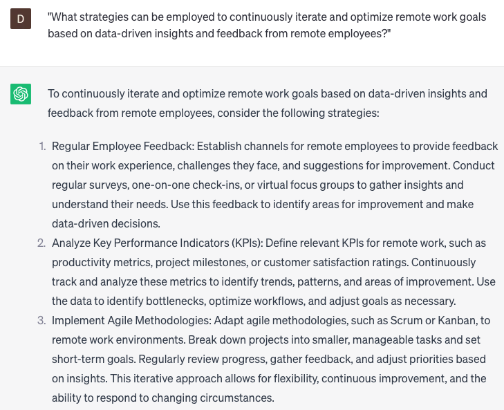

# Analyze remote work goals

### FILL-IN-THE-BLANK **PROMPTS:**

```jsx
Could you offer me insights on enhancing **[specific remote work goals]** for **[team/company name]**? Specifically, I am interested in **[identifying specific metrics]** and devising strategies to accomplish **[specific targets]**.
```

```jsx
How can **[team/company name]** utilize remote work technologies to enhance productivity and collaboration? Specifically, I'm interested in identifying specific technologies and comprehending their integration into **[team/company name]**'s remote work procedures.
```

```jsx
As a remote worker, I am seeking strategies to strike a balance between work and personal life while maximizing productivity. Could you recommend strategies for **[identifying specific work-life balance challenges]** and optimizing my remote work habits to attain **[specific productivity goals]**?
```

### QUESTIONS-BASED P**ROMPTS:**

1. "How can you effectively evaluate and measure the achievement of remote work goals to drive productivity and success?"
2. "What strategies can be used to align remote work goals with the overall organizational objectives and vision?"
3. "How can you assess the impact of remote work goals on employee engagement, satisfaction, and work-life balance?"
4. "What role does data analysis and performance metrics play in analyzing the progress and outcomes of remote work goals?"
5. "How can you identify and address potential challenges or obstacles that may hinder the attainment of remote work goals?"
6. "What tactics can be used to regularly track and review the performance and effectiveness of remote work goals?"
7. "How can you gather feedback and insights from remote employees to gain a comprehensive understanding of the remote work goal attainment process?"
8. "What are the best practices for setting realistic and achievable remote work goals that motivate and inspire remote teams?"
9. "How can you leverage technology and digital tools to analyze and visualize the data related to remote work goals?"
10. "What strategies can be employed to continuously iterate and optimize remote work goals based on data-driven insights and feedback from remote employees?"

### EXAMPLES:

