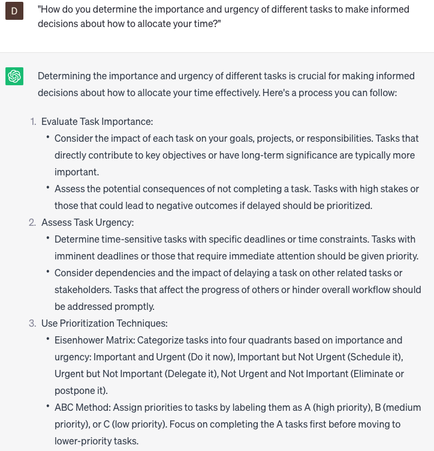

# Analyze time usage

### FILL-IN-THE-BLANK **PROMPTS:**

```jsx
What are some ways I can optimize my time utilization while working on **[project name]** within **[work area]**?
```

```jsx
Could you suggest a tool or application that would assist me in monitoring and tracking my time usage for **[task/project]** in **[work area]**?
```

```jsx
What strategies can I employ to strike a balance between my workload, efficient time management, and effectively handling unforeseen interruptions or emergencies in **[work area]**?
```

### QUESTIONS-BASED P**ROMPTS:**

1. "How can you optimize your daily schedule to make the most efficient use of your time?"
2. "What strategies or techniques can help you prioritize your tasks effectively?"
3. "How do you balance work, personal commitments, and leisure activities in your daily routine?"
4. "In what ways can you eliminate time-wasting activities from your daily life?"
5. "What are some effective methods for managing distractions and staying focused on your tasks?"
6. "How do you ensure that you allocate enough time for self-care and relaxation amidst your busy schedule?"
7. "What steps can you take to enhance your time management skills and increase your productivity?"
8. "What role does setting specific goals play in optimizing your time usage?"
9. "How do you determine the importance and urgency of different tasks to make informed decisions about how to allocate your time?"
10. "What habits or rituals can you adopt to establish a consistent and productive daily routine?"

### EXAMPLES:

