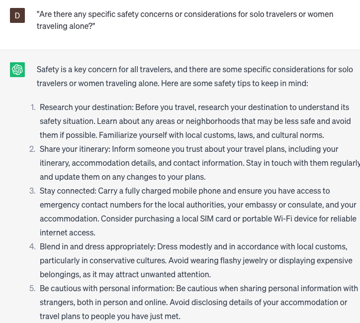

# Analyze travel safety

### FILL-IN-THE-BLANK **PROMPTS:**

```jsx
What are the primary safety considerations for travelers who are visiting **[city/country]**, and what measures can be taken to address them?
```

```jsx
What factors and precautions should be taken into account to **[ensure a secure travel experience/mitigate potential risks/maintain personal well-being]** for **[destination]**? Consider **[destination-specific safety guidelines/common travel scams/emergency preparedness]**.
```

```jsx
Taking into account the prevailing weather conditions in **[city/region]**, what are the potential hazards that travelers may encounter, and what preventive measures should be implemented?
```

### QUESTIONS-BASED P**ROMPTS:**

1. "What are some key factors to consider when assessing the overall safety and security of a travel destination?"
2. "Can you provide insights on reliable sources of information for up-to-date travel advisories and safety alerts?"
3. "What are some precautionary measures travelers can take to minimize risks and ensure personal safety while abroad?"
4. "Are there any specific safety concerns or considerations for solo travelers or women traveling alone?"
5. "Can you suggest strategies for evaluating the safety of transportation options, such as public transportation or ridesharing services?"
6. "What are some indicators or warning signs to watch out for when assessing the safety of accommodations, neighborhoods, or tourist areas?"
7. "Are there any recommended safety precautions for handling money, valuables, and personal belongings while traveling?"
8. "Can you provide insights on common scams, frauds, or tourist-targeted crimes and how to avoid them?"
9. "What are some emergency preparedness tips and resources for travelers, including contact information for local authorities or embassies?"
10. "How can travelers stay informed and adapt to changing safety situations or unforeseen events during their trip?"

### EXAMPLES:

