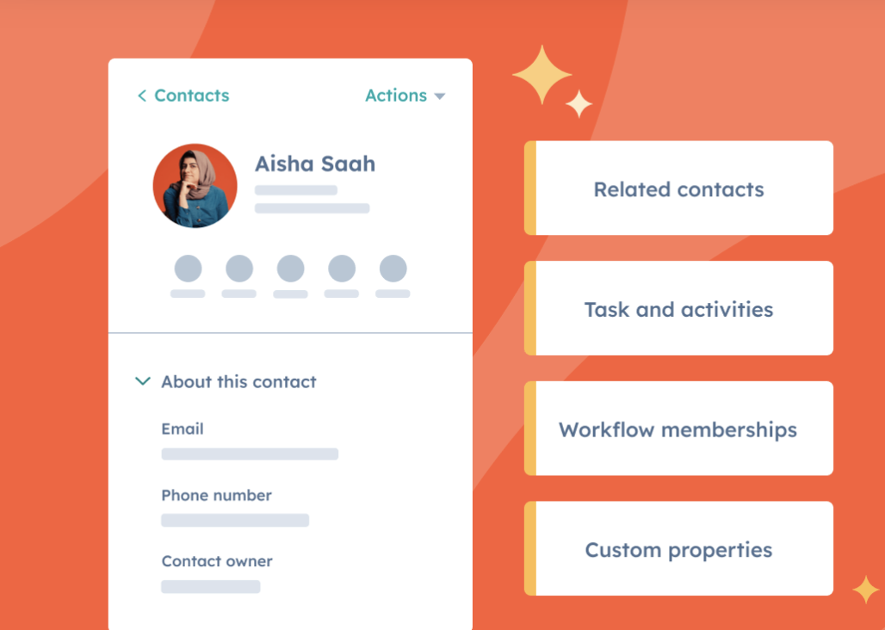

# BONUS: Perfect AI Partner

If you're an **Email Marketing Specialist**, you know how important it is to stay on top of personalized communication. 

[**ActiveCampaign AI**](https://www.activecampaign.com/platform/artificial-intelligence) makes that easy by automating your email sequences. 

You can create workflows that automatically send personalized welcome emails, follow-ups, or even re-engagement campaigns based on how users interact with your content. 

For **Copywriters**, **ChatGPT** is a game-changer when it comes to drafting email copy.

Instead of spending hours coming up with the perfect subject line or crafting the perfect CTA, you can use ChatGPT to generate multiple versions in just seconds. 

As a **List Manager or CRM Specialist**, you need to understand your customers. 

With [**HubSpot AI**](https://www.hubspot.com/products/crm/ai-crm), you can easily segment your email list based on behaviors like purchase history or engagement level. 

The tool even helps you predict customer actions, allowing you to send highly targeted campaigns. 

Plus, with AI-driven insights, you can identify “at-risk” subscribers and send them re-engagement emails before they unsubscribe

