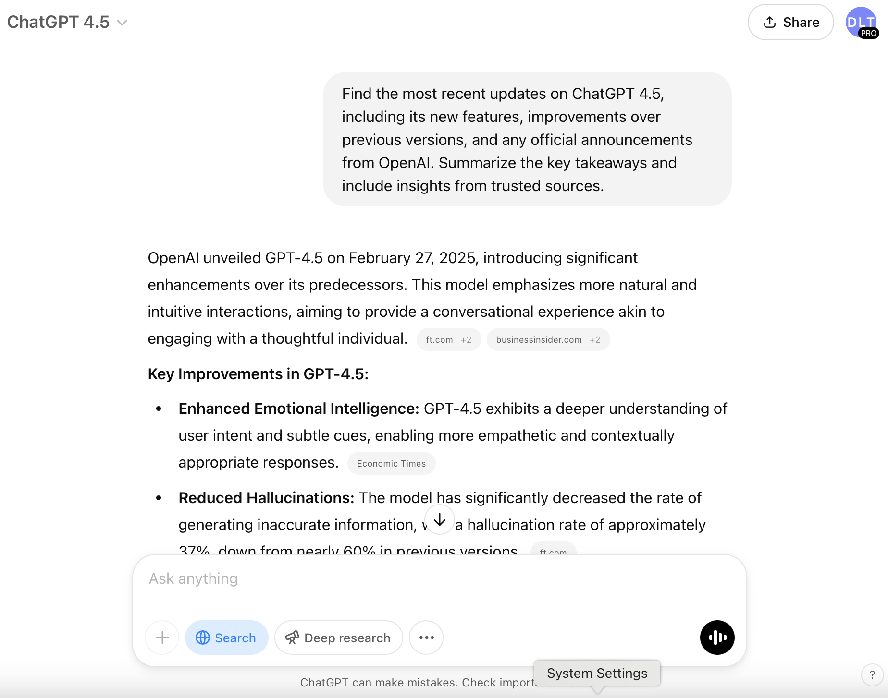

# ChatGPT 4.5: What You Need to Know

**Here’s everything you should know about ChatGPT 4.5 and its latest features! 🤩**

 Plus, you’ll get a few prompts to try out and see it in action!

✅ GPT-4.5 offers more human-like interactions.

✅ This model significantly reduces the occurrence of "hallucinations," where AI provides incorrect or nonsensical answers.

✅ GPT-4.5 excels in complex problem-solving.

✅ The model can access and integrate real-time web information.

Here's a prompt you can try out:

*"I’m a digital marketer focused on increasing engagement and conversions for an e-commerce brand. Using the latest data-driven strategies, provide me with a detailed content marketing plan tailored for [your industry/product]. Include:*

- *A 30-day content calendar with a mix of blog posts, social media updates, and email campaigns.*
- *High-converting copywriting frameworks for ads and landing pages (AIDA, PAS, etc.).*
- *SEO-driven blog post topics with keyword recommendations.*
- *A social media strategy optimized for engagement and organic reach.*
- *Ideas for leveraging AI-generated content and automation to save time and scale efforts.*
- *A breakdown of psychological triggers that will encourage customer action in my niche.*

*Use data-backed insights and real-world case studies to support your recommendations."*

❗GPT-4.5 is currently available to **ChatGPT Pro subscribers**, with plans for wider access soon.

Now, let’s take a look at ChatGPT’s latest updates!

1. **Deep Research**

ChatGPT’s Deep Research feature allows it to perform multi-step, chain-of-thought research, meaning it can explore topics thoroughly.

Unlike basic web searches, it can dive deep, adjust its approach, and refine its results, making it perfect for complex research tasks.

*“I’m planning a [trip/event/project] and need a deep research report on [topic]. Use multi-layered web searches to gather the most relevant, up-to-date information, filter out unreliable sources, and organize findings into key takeaways, insights, and action steps. If needed, adjust your approach mid-research for better accuracy.”*

1. **Search**

ChatGPT's Search feature enables real-time web browsing, allowing it to access and incorporate the most current information available online.

This capability ensures that ChatGPT can provide up-to-date responses, making it particularly useful for inquiries about recent events, live data, or time-sensitive information. 

*"Find the most recent updates on ChatGPT 4.5, including its new features, improvements over previous versions, and any official announcements from OpenAI. Summarize the key takeaways and include insights from trusted sources."*

1. **Projects**

ChatGPT's Projects feature helps users stay organized by creating dedicated folders for related chats.

You can set instructions, attach files, and customize each project with titles for easy navigation.

