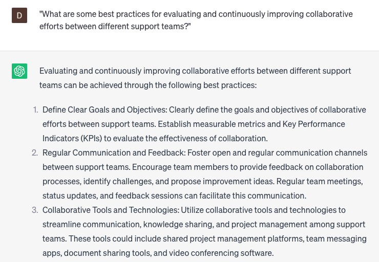

# Collaborating with other support teams

### FILL-IN-THE-BLANK **PROMPTS:**

```jsx
How can we implement successful approaches to **[verb]** and **[verb]** when collaborating with other support teams to address a **[adjective]** and **[adjective]** problem concerning **[product/service]**? How do we guarantee that all relevant **[noun]** are well-informed and **[adjective]** regarding the most up-to-date **[noun]**, ensuring everyone is aligned towards the same **[noun]**?
```

```jsx
In the context of addressing a **[adjective]** and **[adjective]** problem, what strategies can be employed to allocate **[noun]** and **[noun]** effectively among multiple support teams, with the goal of maximizing **[noun]** and minimizing **[noun]**? What tools and techniques can be utilized to maintain shared **[noun]** and promote cohesive collaboration **[adverb]**?
```

```jsx
Establishing robust and efficient connections with other support teams is crucial for achieving success, yet it can be challenging, particularly within a **[adjective]** working environment. What are some recommended approaches and tactics for nurturing **[adjective]** collaboration and cultivating favorable **[noun]** with other teams?
```

### QUESTIONS-BASED P**ROMPTS:**

1. "How can effective collaboration between support teams enhance the overall customer experience?"
2. "What are the key benefits of cross-functional collaboration when handling complex support cases?"
3. "In what ways can you establish clear lines of communication and coordination between different support teams?"
4. "How can collaboration with other support teams contribute to faster resolution times and improved customer satisfaction?"
5. "What strategies can be implemented to ensure seamless handoffs and knowledge transfer between support teams?"
6. "What role does effective documentation and sharing of information play in collaborative support efforts?"
7. "How can you foster a culture of collaboration and mutual support among different support teams?"
8. "What measures can be taken to address potential conflicts or differences in approaches when collaborating with other support teams?"
9. "How can collaborative tools and technologies be leveraged to streamline communication and collaboration between support teams?"
10. "What are some best practices for evaluating and continuously improving collaborative efforts between different support teams?"

### EXAMPLES:

