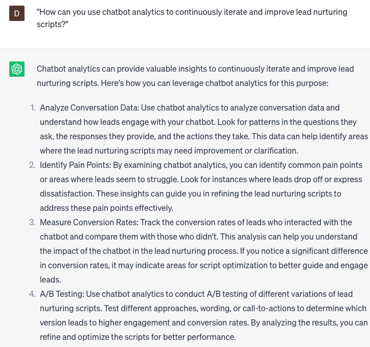

# Crafting custom lead nurturing chatbot scripts

### FILL-IN-THE-BLANK **PROMPTS:**

```jsx
Can you assist me in developing a personalized chatbot script for lead nurturing at **[company name]**, capable of addressing **[questions/concerns]** regarding our **[product/service]** and guiding users through the **[sales funnel/buyer's journey]?**
```

```jsx
Can you create a chatbot script using **[AI/Machine Learning]** that incorporates **[dynamic content/personalized messaging]**, delivering **[relevant/timely information]** to leads according to their **[behavior/interests/buyer's journey stage]**?
```

```jsx
I need assistance in developing a chatbot script capable of engaging leads across various **[channels/platforms]** like **[email/social media/messaging apps]**, ensuring a smooth and consistent experience. The script should be **[personalized/segmented]** according to **[lead behavior/interests/buyer's journey stage]**.
```

### QUESTIONS-BASED P**ROMPTS:**

1. "How can you personalize chatbot scripts to effectively nurture leads throughout their buyer's journey?"
2. "What are some key elements to consider when crafting conversational chatbot scripts for lead nurturing?"
3. "How can you leverage chatbot data and insights to improve the effectiveness of lead nurturing scripts?"
4. "What strategies can be used to engage and build rapport with leads through chatbot interactions?"
5. "How can chatbot scripts be tailored to address common pain points and objections of leads?"
6. "What are the best practices for incorporating persuasive and compelling language into lead nurturing chatbot scripts?"
7. "How can chatbot scripts be designed to seamlessly transition leads from awareness to consideration and decision-making stages?"
8. "What role does personalization and segmentation play in optimizing lead nurturing chatbot scripts?"
9. "How can you use chatbot analytics to continuously iterate and improve lead nurturing scripts?"
10. "What ethical considerations should be taken into account when designing chatbot scripts for lead nurturing?"

### EXAMPLES:

