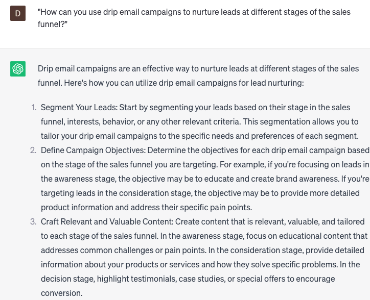

# Crafting drip email campaigns

### FILL-IN-THE-BLANK **PROMPTS:**

```jsx
Can you assist me in devising a drip email campaign for **[specific product/service]**, aimed at **[target audience]** who have expressed an interest or need in **[interest/need]?**
```

```jsx
Could you assist me in crafting a follow-up email promoting the upcoming **[specific event]** we will be hosting next month? The objective is to motivate attendees to complete their event registration.
```

```jsx
Can you assist me in composing an email that introduces our new **[AI course]** to our current subscribers? I'm looking for a captivating and informative introduction to grab their attention.
```

### QUESTIONS-BASED P**ROMPTS:**

1. "What are the essential components of a well-crafted drip email campaign that keeps leads engaged?"
2. "How can you effectively segment your audience to deliver targeted drip email campaigns?"
3. "What strategies can be used to create attention-grabbing subject lines for your drip email campaigns?"
4. "How can you optimize the timing and frequency of your drip emails to maximize engagement?"
5. "What are some effective ways to personalize drip email content and make it relevant to each lead?"
6. "What role do compelling calls-to-action (CTAs) play in driving conversions in drip email campaigns?"
7. "How can you leverage A/B testing to refine and improve the performance of your drip email campaigns?"
8. "What are some best practices for crafting engaging and valuable content in drip emails?"
9. "How can you use drip email campaigns to nurture leads at different stages of the sales funnel?"
10. "What metrics should you track and analyze to evaluate the success of your drip email campaigns?"

### EXAMPLES:

