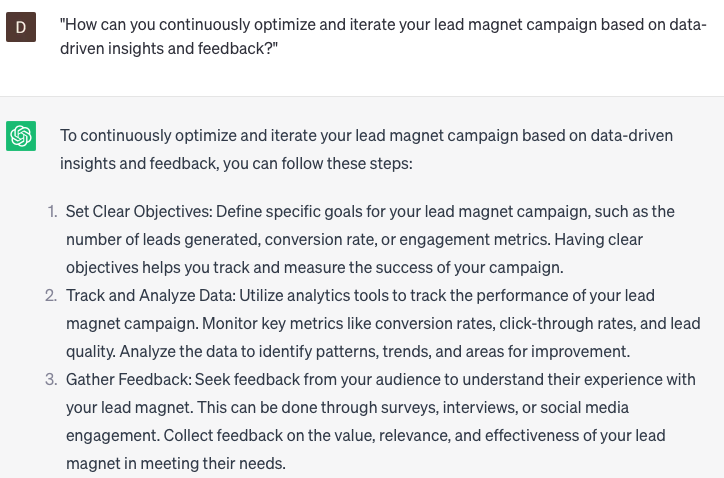

# Crafting lead nurturing lead magnet campaigns

### FILL-IN-THE-BLANK **PROMPTS:**

```jsx
Can you assist me in developing a lead magnet campaign for **[course]**? I'm seeking suggestions for lead magnet ideas that would attract our target audience comprising data scientists and IT professionals.
```

```jsx
Can you assist me in optimizing our lead magnet email sequence for **[course]**? My aim is to ensure that we're delivering value to our leads and effectively nurturing them throughout the sales funnel.
```

```jsx
I'm interested in developing a lead magnet for **[course]** that effectively demonstrates our expertise and establishes credibility with our target audience. Could you please offer some content ideas and messaging recommendations for this purpose?
```

### QUESTIONS-BASED P**ROMPTS:**

1. "What types of lead magnets are most effective in capturing and nurturing leads in your lead magnet campaign?"
2. "How can you align the content and value of your lead magnet with the specific needs and pain points of your target audience?"
3. "What strategies can be used to promote and distribute your lead magnet to maximize its reach and attract qualified leads?"
4. "How can you optimize the landing page experience for your lead magnet campaign to encourage lead conversion?"
5. "What role does effective email follow-up play in nurturing leads after they have downloaded your lead magnet?"
6. "How can you leverage social media platforms and advertising to amplify the reach and visibility of your lead magnet campaign?"
7. "What are some best practices for designing visually appealing and compelling lead magnet assets?"
8. "How can you track and measure the success of your lead magnet campaign in terms of lead generation and lead nurturing?"
9. "What strategies can be used to repurpose and extend the value of your lead magnet content across different marketing channels?"
10. "How can you continuously optimize and iterate your lead magnet campaign based on data-driven insights and feedback?"

### EXAMPLES:

