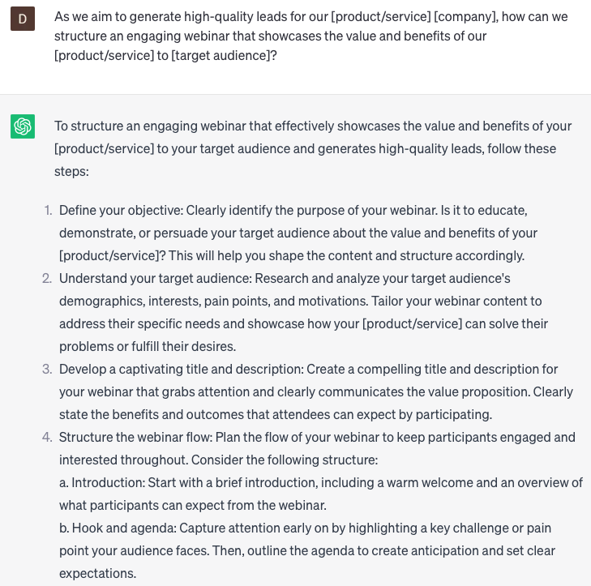

# Crafting webinars for lead generation

### FILL-IN-THE-BLANK **PROMPTS:**

```jsx
Hey ChatGPT, I need assistance in developing a webinar to generate leads for **[company name]**'s **[course]**. Can you provide suggestions for topics and ideas that can engage potential customers and motivate them to enroll in the course?
```

```jsx
As we aim to generate high-quality leads for our **[product/service] [company]**, how can we structure an engaging webinar that showcases the value and benefits of our **[product/service]** to **[target audience]**?
```

```jsx
How can we design an educational webinar series that addresses the pain points and challenges faced by our **[target audience]**? Explore strategies like partnering with industry influencers, providing exclusive resources, and offering post-webinar follow-ups to nurture leads and build lasting relationships.
```

### QUESTIONS-BASED P**ROMPTS:**

1. "How can you design a captivating webinar title that grabs the attention of your target audience and entices them to register?"
2. "What strategies can you employ to create compelling webinar content that addresses the pain points and challenges of your target audience?"
3. "How do you structure your webinar to provide value, build trust, and position your brand as an expert in the industry?"
4. "What techniques can you use to promote your webinar effectively across different channels and maximize registration numbers?"
5. "How can you engage your webinar attendees and keep them actively participating throughout the session?"
6. "What strategies can you employ to generate quality leads during and after the webinar, ensuring maximum conversion rates?"
7. "How do you effectively incorporate calls-to-action (CTAs) within your webinar to drive lead generation and nurture prospects?"
8. "What methods can you use to follow up with webinar attendees and nurture the leads generated from the webinar?"
9. "How can you leverage guest speakers or influencers to enhance the credibility and reach of your webinar for lead generation?"
10. "What metrics and analytics should you track to measure the success of your webinar and continually optimize your lead generation strategy?"

### EXAMPLES:

