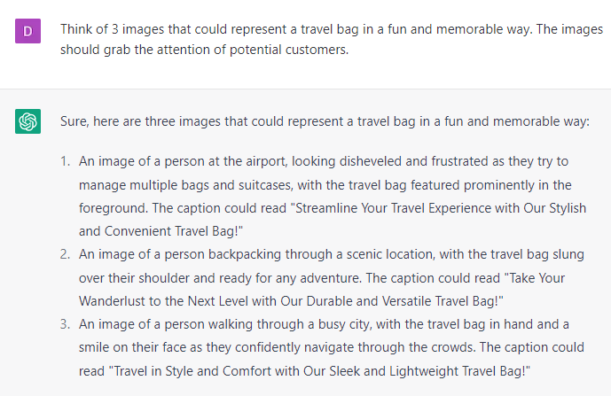

# Creating Attention-Grabbing Images

### FILL-IN-THE-BLANK PROMPTS**:**

```jsx
Describe an image that represents **[product/service]** in a **[luxurious/adventurous/modern etc]** style. How can you use typography, color, and other design elements to achieve this look and feel?
```

```jsx
On Chat GPT: Describe in detail **[image]**. Use as many adjectives and descriptors as possible.

Then input those descriptors into  another AI art generator like DALL-E2 or Midjourney.
```

```jsx
Think of 3 images that could represent **[product]** in a fun and memorable way. The images should grab the attention of potential customers.
```

```jsx
Prompt 1: What kind of images would best represent **[topic]**?

Prompt 2: List the adjectives of **[the image or scene you chose]**

Prompt 3: Describe in detail **[the image or scene you chose]**

Input all that information into an AI Art Generator like Dall-E or Midjourney.
```

### EXAMPLES:


