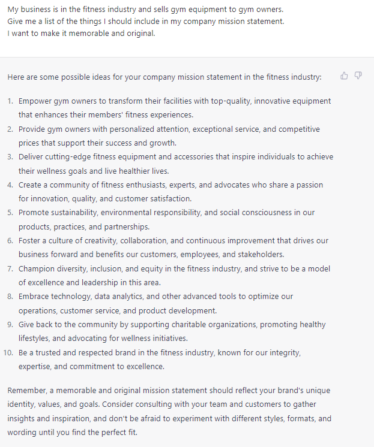

# Creating Your Business Mission

### FILL-IN-THE-BLANK **PROMPTS:**

```jsx
Improve the next mission statement making it more persuasive for **[target audience]** by emphasizing **[key benefits/attributes]** that are most important to them.

**[Company name]** exists to **[describe purposes/functions]** by **[explain key activities and strategies]**. We aim to **[desired outcome/impact]** for **[target audience]** while adhering to 
**[core values/principles]**. 
```

```jsx
My company **[company name], is in [industry]** industry and offers **[describe services/product /activities]** to **[target market]** in order to **[purpose of the business].**
We have been in business since **[launching date]**.
Help me brainstorm **some** company mission statements that incorporate these elements and convey our unique value proposition.
```

```jsx
My business is in the **[industry]** and sells **[type of product]** to **[target audience]**.
Give me a list of the things I should include in my company mission statement.
I want to make it **[adjectives]**.
```

### QUESTIONS-BASED P**ROMPTS:**

1. "What's the process for establishing a business mission statement?"
2. "Can you provide guidance on how to create a strong and effective business mission?"
3. "I'm unsure how to develop a meaningful business mission. Can you help with that?"
4. "What are the key elements that should be included in a business mission statement?"
5. "Can you provide examples of successful business mission statements?"
6. "What's the importance of having a clear business mission, and how can I create one?"
7. "Would it be possible for you to guide me through the steps of creating a business mission statement?"
8. "Can you help me identify the core values that should be reflected in my business mission statement?"
9. "I'm looking for assistance in creating a business mission statement that resonates with my target audience. Can you help with that?"
10. "What are some common mistakes to avoid when creating a business mission statement?"

### EXAMPLES:

