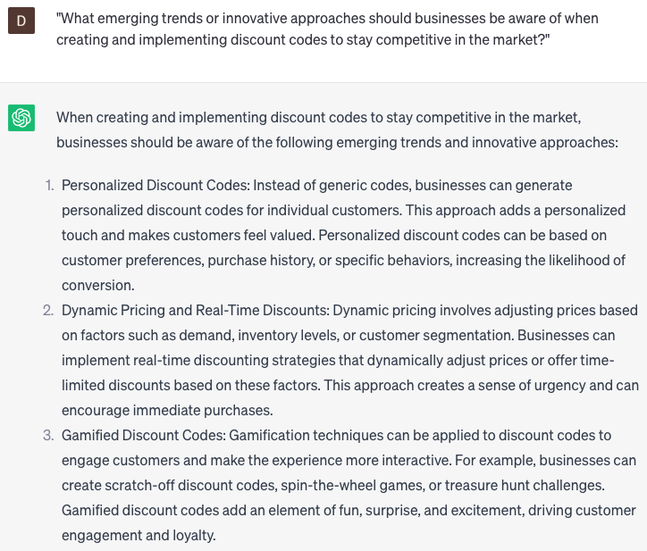

# Creating discount codes

### FILL-IN-THE-BLANK **PROMPTS:**

```jsx
Could you propose distinctive discount codes that are in line with the goals of my **[business type]** business and cater to my target audience?
```

```jsx
I'm in need of a discount code for my **[product name].** Could you present me with several alternatives to select from?
```

```jsx
As I plan a sale for the **[seasonal event]**, what are the most effective categories of discount codes I can utilize to accomplish my sales objectives?
```

### QUESTIONS-BASED P**ROMPTS:**

1. "What are some effective strategies for creating discount codes that incentivize customer purchases while maintaining profitability?"
2. "How can businesses determine the appropriate discount value or percentage to offer through discount codes to maximize conversion rates?"
3. "What are some creative ways businesses can promote and distribute their discount codes to reach a wider audience and generate buzz?"
4. "How can businesses use limited-time or exclusive discount codes to create a sense of urgency and drive immediate customer action?"
5. "What measures can businesses take to prevent discount code abuse or unauthorized sharing, while still providing a positive customer experience?"
6. "What role does personalized targeting play in creating discount codes, and how can businesses tailor codes to specific customer segments or loyalty tiers?"
7. "What are some effective strategies for tracking and analyzing the performance of discount codes, including redemption rates and impact on sales?"
8. "How can businesses use discount codes as part of their customer retention strategy, encouraging repeat purchases and fostering loyalty?"
9. "What considerations should businesses keep in mind when setting expiration dates or usage limitations for their discount codes?"
10. "What emerging trends or innovative approaches should businesses be aware of when creating and implementing discount codes to stay competitive in the market?"

### EXAMPLES:

