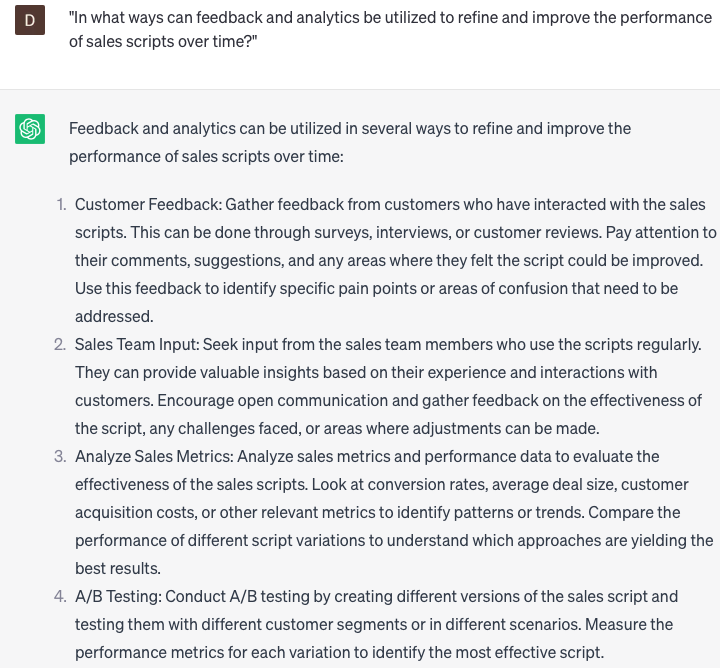

# Creating sales scripts

### FILL-IN-THE-BLANK **PROMPTS:**

```jsx
Could you please create a sales script highlighting the **[distinctive feature/advantage]** of **[product/service name]** and how it effectively addresses the **[customer pain point]**?
```

```jsx
I require your assistance in generating a persuasive sales script that will effectively convince **[target audience]** to invest in our **[product/service name]**. Could you assist me by emphasizing its **[competitive advantage]** and showcasing the **[unique value proposition]** it offers?
```

```jsx
I'm in need of your expertise to create a captivating sales script for **[product/service name]**, with a primary emphasis on its **[unique selling point]** and its profound ability to assist **[target audience]** in attaining their desired **[outcome]**. Can you lend your assistance in crafting an engaging pitch for me?
```

### QUESTIONS-BASED P**ROMPTS:**

1. "How can well-crafted sales scripts effectively guide and empower sales representatives to engage with potential customers?"
2. "What key elements should be included in sales scripts to capture the attention and interest of prospects?"
3. "How can the use of persuasive language and storytelling techniques enhance the effectiveness of sales scripts?"
4. "What strategies can be employed to address common objections and concerns in sales scripts, increasing the chances of closing a sale?"
5. "How can sales scripts be tailored to different customer personas or market segments to maximize their impact?"
6. "What role does active listening and effective questioning play in sales scripts to understand customer needs and tailor solutions?"
7. "What are the benefits of incorporating success stories or case studies in sales scripts to demonstrate value and build trust?"
8. "How can sales scripts be designed to create a sense of urgency and prompt immediate action from potential customers?"
9. "What techniques can be used to train and coach sales representatives on delivering sales scripts confidently and authentically?"
10. "In what ways can feedback and analytics be utilized to refine and improve the performance of sales scripts over time?"

### EXAMPLES:

