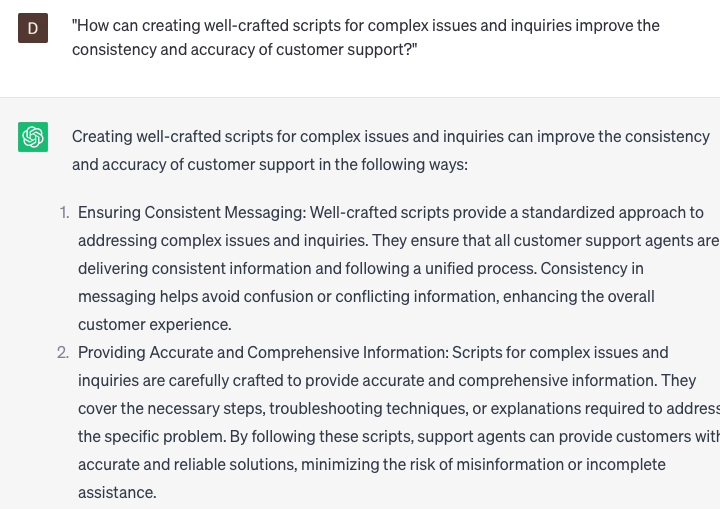

# Creating scripts for complex issues and inquiries

### FILL-IN-THE-BLANK **PROMPTS:**

```jsx
Could you assist me by generating a script tailored for **[specific type of issue or inquiry]**? Please include a comprehensive outline of the necessary steps for **[required action]**, along with any additional considerations to account for **[relevant factors]**.
```

```jsx
I require a detailed script that addresses **[specific aspect of issue or inquiry]**. Can you please provide an elaborate outline that encompasses the necessary **[required steps]**, while also addressing potential challenges and offering solutions to overcome them?
```

```jsx
Our team is currently confronted with a challenge concerning **[specific product or service].** Could you craft a script that effectively addresses the **[specific problem]** and offers precise instructions for the **[required action]**?
```

### QUESTIONS-BASED P**ROMPTS:**

1. "How can creating well-crafted scripts for complex issues and inquiries improve the consistency and accuracy of customer support?"
2. "What key elements should be included in scripts for handling complex issues and inquiries to ensure comprehensive and effective responses?"
3. "How can active listening and empathy be incorporated into scripts to provide personalized support for customers with complex problems?"
4. "What strategies can be employed to simplify complex technical concepts or procedures in scripts for better customer understanding?"
5. "How can scripts for complex issues and inquiries be adaptable and flexible to accommodate unique customer situations?"
6. "What role does thorough product knowledge and ongoing training play in developing scripts for complex issues and inquiries?"
7. "What are the benefits of utilizing decision trees or flowcharts within scripts to guide support agents through complex troubleshooting processes?"
8. "How can scripts be designed to encourage collaboration and effective communication between support agents and customers during complex issue resolution?"
9. "What techniques can be used to incorporate relevant resources, such as FAQs or knowledge base articles, into scripts for efficient problem-solving?"
10. "In what ways can customer feedback and data analysis be utilized to continuously refine and improve scripts for handling complex issues and inquiries?"

### EXAMPLES:

