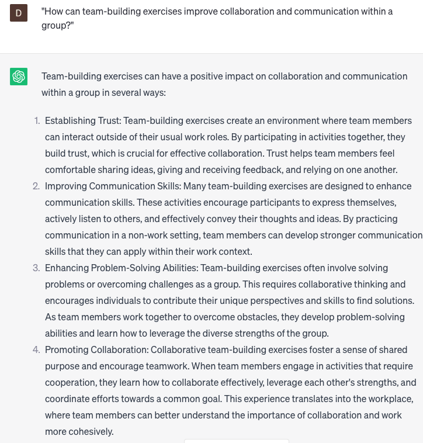

# Creating team-building exercises

### FILL-IN-THE-BLANK **PROMPTS:**

```jsx
As a team comprising **[number]** individuals with varied backgrounds and skill sets, we are seeking team-building activities that foster **[cultural awareness]**, encourage **[collaboration]**, and stimulate **[creative problem-solving]**. Could you provide suggestions for exercises that would effectively meet these objectives?
```

```jsx
Given the challenges our team has encountered in **[communication]** and **[conflict resolution]**, we are actively seeking team-building exercises that specifically target these areas. With **[number]** team members and the need for remote-friendly activities, we kindly request your suggestions for exercises that fulfill these criteria.
```

```jsx
As a team consisting of **[number]** individuals who are newly acquainted, we are in need of team-building exercises that actively foster **[trust], [creativity]**, and **[accountability]**. Could you recommend exercises specifically designed for new teams that can be completed within a timeframe of **[less than an hour]**?
```

### QUESTIONS-BASED P**ROMPTS:**

1. "How can team-building exercises improve collaboration and communication within a group?"
2. "What are some creative team-building exercises that can foster trust and cooperation among team members?"
3. "Why is it important to tailor team-building exercises to the specific needs and goals of a team?"
4. "What role do team-building exercises play in enhancing employee morale and job satisfaction?"
5. "How can team-building exercises contribute to developing strong leadership skills within a team?"
6. "What are some effective team-building exercises that can help resolve conflicts and improve team dynamics?"
7. "In what ways can team-building exercises promote innovation and creativity among team members?"
8. "How do team-building exercises contribute to building a positive and inclusive team culture?"
9. "What are some team-building exercises that can help improve problem-solving and decision-making skills?"
10. "How can team-building exercises outside the workplace, such as outdoor activities or volunteering, positively impact team cohesion and motivation?"

### EXAMPLES:

