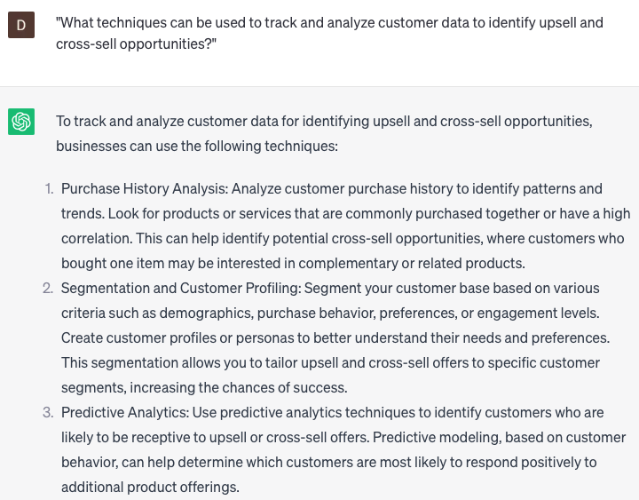

# Creating upsell and cross-sell recommendations

### FILL-IN-THE-BLANK **PROMPTS:**

```jsx
What are the probable future product preferences within the **[product category]** for customers, considering their purchase history, to fulfill their specific **[need]** requirements? Moreover, how can we optimize our marketing strategies to effectively promote these products to them?
```

```jsx
What are the **[number]** most suitable products within the **[product category]** that would enhance the recently purchased **[specific product]**, taking into account the customer's **[specific situation]** situation and their **[specific preference]** preferences?
```

```jsx
Considering the customer's **[specific preference]** preferences and **[budget]** budget, what **[product category]** products would be ideal recommendations for customers who have recently viewed the **[specific product]** but did not make a purchase? Furthermore, how can we efficiently convey these recommendations to them?
```

### QUESTIONS-BASED P**ROMPTS:**

1. "How can upselling and cross-selling recommendations enhance the overall customer experience and drive revenue growth?"
2. "What criteria should be considered when selecting products to upsell or cross-sell to customers?"
3. "How can personalized product recommendations based on customer preferences and purchasing behavior increase upsell and cross-sell success?"
4. "What strategies can be employed to effectively communicate the value and benefits of upsell and cross-sell products to customers?"
5. "How can bundling or package deals be utilized to encourage customers to explore additional products or upgrade their purchases?"
6. "What role does effective product positioning and merchandising play in maximizing upsell and cross-sell opportunities?"
7. "What are the benefits of incorporating social proof, such as customer reviews or testimonials, in upsell and cross-sell recommendations?"
8. "How can targeted email marketing or personalized notifications be utilized to deliver upsell and cross-sell recommendations at the right time?"
9. "What techniques can be used to track and analyze customer data to identify upsell and cross-sell opportunities?"
10. "In what ways can customer service representatives be trained to effectively upsell and cross-sell to customers during interactions?"

### EXAMPLES:

