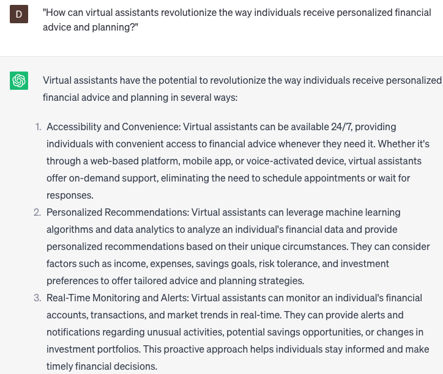

# Creating virtual assistants for financial advice and planning

### FILL-IN-THE-BLANK **PROMPTS:**

```jsx
What is the process or sequence of steps required to develop a virtual assistant, based on **[voice/chat]** interactions, that offers **[personalized/customized]** financial advice and planning services? Furthermore, how can **[ChatGPT/other AI technologies]** be seamlessly incorporated into the **[UI/UX/architecture]** of the virtual assistant?
```

```jsx
What are the potential ways to harness the capabilities of **[natural language processing/NLP]**, **[machine learning/ML]**, and **[big data analytics]** techniques to improve the **[accuracy/reliability/personalization]** of the **[financial advice/recommendations/planning]** delivered by the virtual assistant? Additionally, could you suggest any **[datasets/algorithms/models]** that are advisable or accessible for this objective?
```

```jsx
Could you share some **[best practices/tips/guidelines]** on **[training/evaluating/testing]** a virtual assistant designed to offer **[comprehensive/real-time/on-demand]** financial advice and planning services? Additionally, how can **[user feedback/analytics/anomaly detection]** be leveraged to enhance the **[performance/efficiency/effectiveness]** of the virtual assistant progressively?
```

### QUESTIONS-BASED P**ROMPTS:**

1. "How can virtual assistants revolutionize the way individuals receive personalized financial advice and planning?"
2. "What are the key features and capabilities that a virtual assistant for financial advice should possess to effectively assist users in managing their finances?"
3. "In your opinion, how can virtual assistants leverage artificial intelligence and machine learning algorithms to provide accurate and up-to-date financial recommendations?"
4. "What ethical considerations should be taken into account when designing virtual assistants for financial advice to ensure transparency and user trust?"
5. "How can virtual assistants address the unique financial needs and goals of individual users while still providing comprehensive and holistic advice?"
6. "What steps can virtual assistants take to ensure the security and confidentiality of users' financial information and transactions?"
7. "In what ways can virtual assistants for financial advice help individuals track their spending habits, budget effectively, and achieve their financial goals?"
8. "What potential challenges or limitations do you foresee in the development and adoption of virtual assistants for financial advice, and how can they be overcome?"
9. "How can virtual assistants provide continuous learning and improvement, adapting to changing market conditions and financial regulations?"
10. "What role do you envision virtual assistants playing in bridging the gap between financial institutions and individuals, providing accessible and personalized financial guidance?"

### EXAMPLES:

