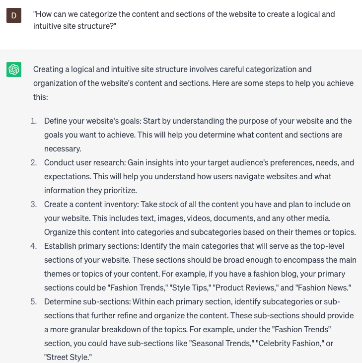

# Develop site structure

### FILL-IN-THE-BLANK **PROMPTS:**

```jsx
Could you recommend a site structure that is specifically tailored to the purpose of **[site purpose]** and aligns with the needs and preferences of my **[target audience]**?
```

```jsx
Imagine you are tasked with developing the site structure for a brand in the **[niche/industry]**. How would you organize the website's content to ensure easy navigation and seamless user experience? Share your approach and key considerations for structuring the site efficiently.
```

```jsx
Considering the **[type of content]** that I intend to include on my website, what site structure would be the most efficient in delivering an exceptional user experience, with **[number]** subcategories and pages that facilitate effortless navigation?
```

### QUESTIONS-BASED P**ROMPTS:**

1. "What is the most efficient way to organize the site structure to ensure optimal user experience and navigation?"
2. "How can we categorize the content and sections of the website to create a logical and intuitive site structure?"
3. "What are the key considerations in determining the main navigation menu and its hierarchy within the site structure?"
4. "How can we implement breadcrumbs or other navigational aids to enhance the user's understanding of their location within the site structure?"
5. "What strategies can be employed to establish a clear and concise URL structure that aligns with the overall site organization?"
6. "What methods can we use to create a scalable site structure that can accommodate future growth and expansion?"
7. "How can we optimize the site structure for search engine visibility and improve the website's overall search rankings?"
8. "What approaches can be taken to ensure a mobile-friendly site structure that provides a seamless experience across different devices?"
9. "What techniques or tools can we utilize to conduct user testing and gather feedback on the effectiveness of the site structure?"
10. "How can we continuously monitor and analyze user behavior and engagement data to identify opportunities for refining and improving the site structure?"

### EXAMPLES:

