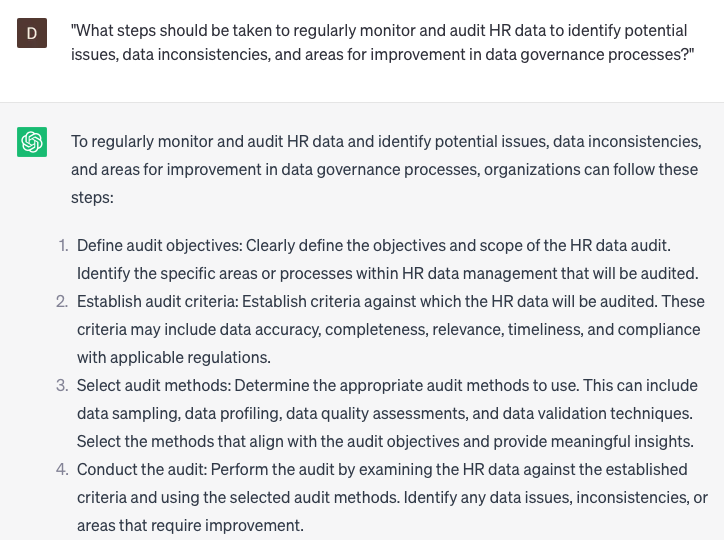

# Developing HR data governance strategies

### FILL-IN-THE-BLANK **PROMPTS:**

```jsx
What are the primary HR data governance challenges specific to **[specific industry]** organizations, and how can **[specific organization]** effectively tackle these challenges while adhering to **[specific data protection regulation]** and accomplishing **[specific organizational goal]**?
```

```jsx
In what ways can **[specific technology solution]** be leveraged to augment **[specific data privacy/security goal]**, and what are the possible ethical, legal, and social ramifications that **[specific organization]** should take into account when integrating this solution into its HR data governance framework?
```

```jsx
Could you offer insights into how **[specific organization]** can harness emerging technologies, like **[specific technology]**, to revolutionize its HR data governance practices? Additionally, what are the potential advantages and risks associated with adopting these technologies?
```

### QUESTIONS-BASED P**ROMPTS:**

1. "Why is it crucial for organizations to develop effective HR data governance strategies to ensure the accuracy, integrity, and accessibility of HR data?"
2. "What are the key components that should be included in HR data governance strategies to establish clear roles, responsibilities, and processes for managing HR data?"
3. "How can organizations establish data quality standards and protocols to maintain the consistency and reliability of HR data?"
4. "In what ways can HR data governance strategies address data privacy and security concerns, ensuring compliance with relevant regulations and protecting sensitive employee information?"
5. "What measures should be taken to define data ownership and establish data stewardship roles within the organization to oversee the management and governance of HR data?"
6. "How can organizations implement data classification frameworks and access controls to ensure appropriate levels of data protection and confidentiality?"
7. "What role can data governance committees or steering groups play in overseeing and guiding HR data governance initiatives within the organization?"
8. "How can organizations establish data governance policies and procedures to guide data collection, storage, sharing, and disposal practices in alignment with legal and ethical requirements?"
9. "What steps should be taken to regularly monitor and audit HR data to identify potential issues, data inconsistencies, and areas for improvement in data governance processes?"
10. "How can organizations promote a culture of data governance and data-driven decision-making by providing training and awareness programs to employees on HR data governance best practices?"

### EXAMPLES:

