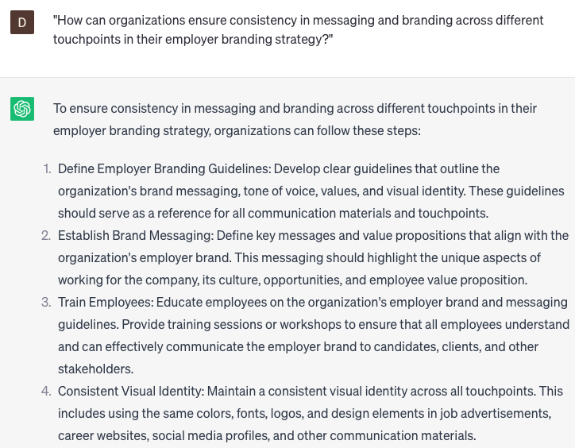

# Developing employer branding strategy

### FILL-IN-THE-BLANK **PROMPTS:**

```jsx
Considering our **[research/analysis]**, which **[demographic/psychographic]** aspects should we take into account while targeting **[specific type of employees]** in [**industry/region]**? How can we customize our messaging and content to resonate with their **[needs/motivations/values]**?
```

```jsx
Could you share some examples of successful employer branding campaigns, either **[industry-specific/global]**, that have effectively **[attracted/retained/motivated] [specific type of employees]** in **[region/country]**? How can we adapt these best practices to our own strategy and develop a **[unique/differentiated]** employer brand?
```

```jsx
Which **[metrics/KPIs]** should we monitor to assess the impact of our employer branding initiatives? How can we **[utilize data/analytics/solicit feedback]** to consistently enhance our employer brand and effectively **[attract/retain/motivate]** our **[target audience/employee personas]**?
```

### QUESTIONS-BASED P**ROMPTS:**

1. Why is it important for organizations to develop a strong employer branding strategy?"
2. "What key elements should be considered when defining the unique employer value proposition (EVP) as part of the employer branding strategy?"
3. "How can organizations effectively communicate their mission, vision, and company culture through their employer branding strategy?"
4. "What role does employee testimonials and stories play in shaping the employer branding strategy?"
5. "How can organizations leverage social media and online platforms to enhance their employer branding efforts?"
6. "Why is it important to align the employer branding strategy with the overall organizational brand and values?"
7. "What strategies can organizations employ to attract and retain top talent through their employer branding strategy?"
8. "How can organizations showcase career growth opportunities and development programs as part of their employer branding strategy?"
9. "What measures can be taken to continuously evaluate and improve the effectiveness of the employer branding strategy?"
10. "How can organizations ensure consistency in messaging and branding across different touchpoints in their employer branding strategy?"

### EXAMPLES:

