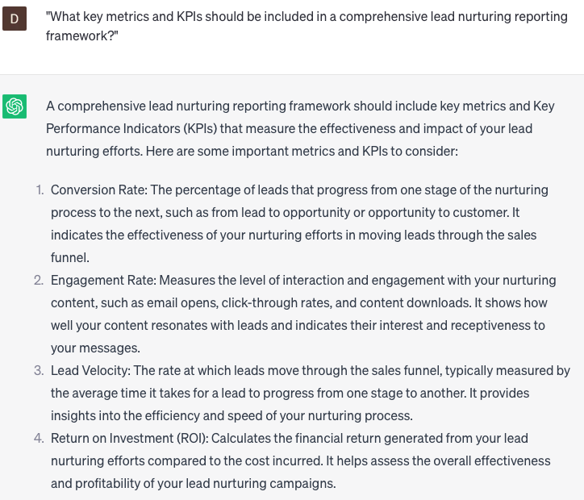

# Developing lead nurturing reporting frameworks

### FILL-IN-THE-BLANK **PROMPTS:**

```jsx
I require assistance in creating a lead nurturing reporting framework for **[course]**. Can you provide recommendations on the key metrics to track and suggest effective ways to visually present the data in an engaging manner?
```

```jsx
Could you assist me in building a lead scoring system for **[course]** that considers various data points, including engagement, demographics, and behavior?
```

```jsx
I require a comprehensive analysis of the performance of **[course]** lead nurturing campaign to present to our executive team. Can you provide in-depth insights on the campaign's effectiveness, encompassing conversion rates, email engagement, and ROI?
```

### QUESTIONS-BASED P**ROMPTS:**

1. "What key metrics and KPIs should be included in a comprehensive lead nurturing reporting framework?"
2. "How can you visualize and present lead nurturing performance data effectively in your reporting framework?"
3. "What strategies can be used to track and measure the impact of lead nurturing on conversion rates and revenue generation?"
4. "How can you integrate marketing automation and CRM data into your lead nurturing reporting framework for a holistic view of lead interactions?"
5. "What role does lead scoring and qualification play in measuring the effectiveness of lead nurturing efforts within the reporting framework?"
6. "How can you track and analyze the progression of leads through different stages of the sales funnel within the lead nurturing reporting framework?"
7. "What are some best practices for identifying and reporting on the most successful lead nurturing campaigns and sequences?"
8. "How can you measure and report on the ROI (Return on Investment) of your lead nurturing initiatives within the reporting framework?"
9. "What tactics can be used to gather feedback from sales teams and incorporate their insights into the lead nurturing reporting framework?"
10. "How can you continuously refine and optimize your lead nurturing reporting framework based on data-driven insights and strategic goals?"

### EXAMPLES:

