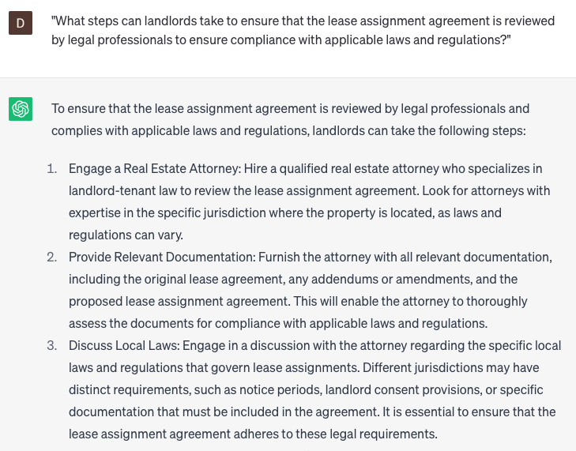

# Developing lease assignment agreements

### FILL-IN-THE-BLANK **PROMPTS:**

```jsx
Could you please supply a template for a lease assignment agreement encompassing clauses pertaining to **[assignment terms]**, **[rental payments]**, **[liability and indemnification]**, **[default and termination]**, and **[remedies]**?
```

```jsx
What are the legal prerequisites for **[lease type]** lease contracts in **[state]** and how can I ensure my agreement is compliant, using legal compliance techniques?
```

```jsx
What are the necessary legal obligations for incorporating **[assignment fees]**, **[governing law provisions], [indemnification], [renewal and extension],** and **[lien rights]** within a lease assignment agreement?
```

### QUESTIONS-BASED P**ROMPTS:**

1. "Why is it important to have a well-crafted lease assignment agreement when allowing tenants to transfer their lease to another party? How does it protect the interests of all parties involved?"
2. "In what ways can a lease assignment agreement outline the rights and responsibilities of the assignor, assignee, and landlord, ensuring a smooth and legally compliant transfer of the lease?"
3. "How does a lease assignment agreement help landlords maintain control over the rental property by establishing criteria for approving or rejecting potential assignees?"
4. "Why is it crucial for a lease assignment agreement to clearly specify the terms and conditions under which the lease can be assigned, including any limitations or restrictions?"
5. "What role does a lease assignment agreement play in transferring the obligations and liabilities from the original tenant to the assignee, ensuring the assignee assumes responsibility for the lease terms?"
6. "How can a lease assignment agreement protect the assignor from potential legal disputes or claims arising from the assigned lease?"
7. "What measures can be included in a lease assignment agreement to address the process and requirements for obtaining landlord consent, documenting the assignment, and notifying relevant parties?"
8. "Why is it important for a lease assignment agreement to outline the consequences of non-compliance or breach of the assigned lease, protecting the landlord's rights and remedies?"
9. "In what ways can a lease assignment agreement address the transfer of security deposits, ensuring a smooth transition and proper refund or transfer to the assignee?"
10. "What steps can landlords take to ensure that the lease assignment agreement is reviewed by legal professionals to ensure compliance with applicable laws and regulations?"

### EXAMPLES:

