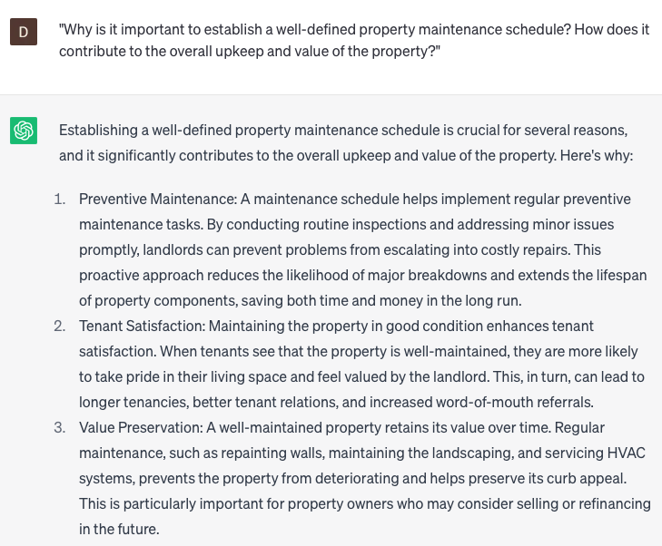

# Developing property maintenance schedules

### FILL-IN-THE-BLANK **PROMPTS:**

```jsx
I am the owner of a **[property type]** located in **[city/state/country]**, which has been in existence for **[age of property]** years. The property consists of **[number of rooms/bedrooms/bathrooms]** and features a **[specific feature such as swimming pool/garden]**. I need your guidance in providing a comprehensive maintenance schedule for the **[HVAC/plumbing/electrical/roofing/landscaping]** systems, along with recommendations on the most suitable time of year to carry out these maintenance tasks.
```

```jsx
Can you guide me through employing a comprehensive Property Valuation and Cash Flow Analysis for my **[property type]** located in **[city/state/country]** while creating a robust maintenance plan? This should consider all relevant factors and maintenance schedules for the **[HVAC/plumbing/electrical/roofing/landscaping]** systems.
```

```jsx
As the new owner of a **[property type]** in **[city/state/country]**, I want to ensure its proper maintenance to prevent potential long-term damage and costly repairs. I would appreciate your assistance in providing a comprehensive maintenance plan for the **[HVAC/plumbing/electrical/roofing/landscaping]** systems, outlining the essential tasks to be performed.
```

### QUESTIONS-BASED P**ROMPTS:**

1. "Why is it important to establish a well-defined property maintenance schedule? How does it contribute to the overall upkeep and value of the property?"
2. "In what ways can a carefully planned property maintenance schedule help prevent costly repairs and address maintenance issues in a timely manner?"
3. "How can a property maintenance schedule ensure compliance with local regulations and safety standards?"
4. "What role does a maintenance schedule play in preserving the aesthetic appeal of the property and creating a positive living environment for tenants?"
5. "How can a proactive property maintenance schedule contribute to tenant satisfaction and retention?"
6. "Why is it crucial to include regular inspections and maintenance tasks in the property maintenance schedule to identify potential issues before they become major problems?"
7. "What measures can be included in a property maintenance schedule to address seasonal maintenance needs, such as HVAC system servicing or gutter cleaning?"
8. "How does a property maintenance schedule help landlords prioritize and allocate resources effectively, ensuring efficient and cost-effective property management?"
9. "Why is it important for a property maintenance schedule to include documentation of completed tasks and any necessary follow-up actions?"
10. "What steps can landlords take to create a collaborative approach with tenants, involving them in the property maintenance schedule and encouraging their participation in reporting maintenance issues?"

### EXAMPLES:

